<!DOCTYPE html><html class="js native-share--disabled" lang="pt-BR" dir="ltr" style="--announcement-bar-height: 126px; --header-height: 847px;"><head>
    <meta charset="utf-8">
    <meta name="viewport" content="width=device-width, initial-scale=1.0, height=device-height, minimum-scale=1.0, maximum-scale=1.0">
    <meta name="theme-color" content="#f7f8fa">

    <title>✨Promoção de Dia dos Pais✨Play2Video Pro CarPlay sem fio/ Android Auto Tudo-em-</title><meta name="description" content="Nova tecnologia tudo-em-um Play2video com ótimo custo-benefício para assistir vídeos no carro é um sucesso entre entusiastas automotivos e oferece excelentes oportunidades para satisfação dos clientes. Aplicativos YouTube e Netflix integrados (*Não é possível baixar outros aplicativos*) Construído com base no CarPlay sem fio e Android Auto, e inclui recursos adic"><link rel="canonical" href="https://ottocastdrive.com/products/play2video-pro"><link rel="shortcut icon" href="images/ottocast-logo-icon-1_1.png">
      <link rel="apple-touch-icon" href="images/ottocast-logo-icon-1.png"><link rel="preconnect" href="https://cdn.shopify.com">
    <link rel="preconnect" href="https://fonts.shopifycdn.com" crossorigin="">
    <link rel="dns-prefetch" href="https://productreviews.shopifycdn.com"><link rel="preload" href="//ottocastdrive.com/cdn/fonts/barlow/barlow_n7.691d1d11f150e857dcbc1c10ef03d825bc378d81.woff2" as="font" type="font/woff2" crossorigin=""><link rel="preload" href="//ottocastdrive.com/cdn/fonts/barlow/barlow_n5.a193a1990790eba0cc5cca569d23799830e90f07.woff2" as="font" type="font/woff2" crossorigin=""><meta property="og:type" content="product">
  <meta property="og:title" content="✨Promoção de Dia dos Pais✨Play2Video Pro CarPlay sem fio/ Android Auto Adaptador tudo-em-um">
  <meta property="product:price:amount" content="78,95">
  <meta property="product:price:currency" content="EUR"><meta property="og:image" content="images/CA400V4_17.jpg">
  <meta property="og:image:secure_url" content="images/CA400V4_17.jpg">
  <meta property="og:image:width" content="1200">
  <meta property="og:image:height" content="1200"><meta property="og:description" content="Nova tecnologia tudo-em-um Play2video com ótimo custo-benefício para assistir vídeos no carro é um sucesso entre entusiastas automotivos e oferece excelentes oportunidades para satisfação dos clientes. Aplicativos YouTube e Netflix integrados (*Não é possível baixar outros aplicativos*) Construído com base no CarPlay sem fio e Android Auto, e inclui recursos adic"><meta property="og:url" content="https://ottocastdrive.com/products/play2video-pro">
<meta property="og:site_name" content="Ottocastdrive"><meta name="twitter:card" content="summary"><meta name="twitter:title" content="✨Promoção de Dia dos Pais✨Play2Video Pro CarPlay sem fio/ Android Auto Adaptador tudo-em-um">
  <meta name="twitter:description" content="Nova tecnologia tudo-em-um Play2video com ótimo custo-benefício para assistir vídeos no carro é um sucesso entre entusiastas automotivos e oferece excelentes oportunidades para satisfação dos clientes. Aplicativos YouTube e Netflix integrados (*Não é possível baixar outros aplicativos*) Construído com base no CarPlay sem fio e Android Auto, e com aplicativos YouTube e Netflix integrados para atender às suas necessidades de vídeo enquanto dirige. CarPlay sem fio e Android Auto Inteligente o suficiente para reconhecer o modelo do seu celular. Compatível com celulares Android e Apple, tornando-se uma ótima escolha para toda a família. Alternância entre três sistemas a qualquer momento Alterne facilmente entre o sistema Android, CarPlay sem fio e Android Auto sem fio a qualquer momento Reprodução multimídia via USB Conexão automática e super desempenho O Wi-Fi de banda dupla e o processador de dois núcleos ajudam a eliminar atrasos e oferecem conexão fluida em tempo real para uma experiência sem travamentos Totalmente integrado"><meta name="twitter:image" content="https://ottocastdrive.com/cdn/shop/files/CA400V4.jpg?crop=center&height=1200&v=1752568491&width=1200">
  <meta name="twitter:image:alt" content="">
  

  

    
    

    <meta id="shopify-digital-wallet" name="shopify-digital-wallet" content="/62023237710/digital_wallets/dialog">
<meta name="shopify-checkout-api-token" content="3372d182559a43c5814ca9357521371a">
<meta id="in-context-paypal-metadata" data-shop-id="62023237710" data-venmo-supported="true" data-environment="production" data-locale="pt_BR" data-paypal-v4="true" data-currency="EUR">
<link rel="alternate" hreflang="x-default" href="https://ottocastdrive.com/products/play2video-pro">
<link rel="alternate" hreflang="pt-BR" href="https://ottocastdrive.com/products/play2video-pro">
<link rel="alternate" hreflang="it" href="https://ottocastdrive.com/it/products/play2video-pro">
<link rel="alternate" hreflang="es" href="https://ottocastdrive.com/es/products/play2video-pro">
<link rel="alternate" hreflang="de" href="https://ottocastdrive.com/de/products/play2video-pro">
<link rel="alternate" hreflang="fr" href="https://ottocastdrive.com/fr/products/play2video-pro">
<link rel="alternate" hreflang="pt" href="https://ottocastdrive.com/pt/products/play2video-pro">
<link rel="alternate" hreflang="it-IT" href="https://ottocastdrive.com/it-it/products/play2video-pro">
<link rel="alternate" hreflang="en-IT" href="https://ottocastdrive.com/en-it/products/play2video-pro">
<link rel="alternate" hreflang="de-IT" href="https://ottocastdrive.com/de-it/products/play2video-pro">
<link rel="alternate" hreflang="fr-IT" href="https://ottocastdrive.com/fr-it/products/play2video-pro">
<link rel="alternate" hreflang="pt-IT" href="https://ottocastdrive.com/pt-it/products/play2video-pro">
<link rel="alternate" hreflang="es-IT" href="https://ottocastdrive.com/es-it/products/play2video-pro">
<link rel="alternate" type="application/json+oembed" href="https://ottocastdrive.com/products/play2video-pro.oembed">

<link rel="preconnect" href="https://shop.app" crossorigin="anonymous">

  width: 100%;
}

#shopify-buyer-consent.hidden {
  display: none;
}

#shopify-subscription-policy-button {
  background: none;
  border: none;
  padding: 0;
  text-decoration: underline;
  font-size: inherit;
  cursor: pointer;
}

#shopify-subscription-policy-button::before {
  box-shadow: none;
}

      </style>

<link href="css/theme.css" rel="stylesheet" type="text/css" media="all"><link href="css/kik-style.css" rel="stylesheet" type="text/css" media="all"><link href="https://monorail-edge.shopifysvc.com" rel="dns-prefetch">

      script.src = '//ottocastdrive.com/cdn/s/trekkie.storefront.5d09078cf9d86e817092d3c8552eb836b6ffff06.min.js';
      first.parentNode.insertBefore(script, first);
    };
    trekkie.load(
      {"Trekkie":{"appName":"storefront","development":false,"defaultAttributes":{"shopId":62023237710,"isMerchantRequest":null,"themeId":140018778190,"themeCityHash":"10251582303510677998","contentLanguage":"en","currency":"EUR","eventMetadataId":"2f777ff5-a1ee-43e6-9866-34fef90821c3"},"isServerSideCookieWritingEnabled":true,"monorailRegion":"shop_domain","enabledBetaFlags":["65f19447","b5387b81"]},"Session Attribution":{},"S2S":{"facebookCapiEnabled":false,"source":"trekkie-storefront-renderer","apiClientId":580111}}
    );

    var loaded = false;
    trekkie.ready(function() {
      if (loaded) return;
      loaded = true;

      window.ShopifyAnalytics.lib = window.trekkie;

      var originalDocumentWrite = document.write;
      document.write = customDocumentWrite;
      try { window.ShopifyAnalytics.merchantGoogleAnalytics.call(this); } catch(error) {};
      document.write = originalDocumentWrite;

      window.ShopifyAnalytics.lib.page(null,{"pageType":"product","resourceType":"product","resourceId":7512232656974,"requestId":"4c946864-e5ae-4996-85c2-29a02c632ba0-1773166734","shopifyEmitted":true});

      var match = window.location.pathname.match(/checkouts\/(.+)\/(thank_you|post_purchase)/)
      var token = match? match[1]: undefined;
      if (!hasLoggedConversion(token)) {
        setCookieIfConversion(token);
        window.ShopifyAnalytics.lib.track("Viewed Product",{"currency":"EUR","variantId":42045392552014,"productId":7512232656974,"productGid":"gid:\/\/shopify\/Product\/7512232656974","name":"✨Promoção de Dia dos Pais✨Play2Video Pro CarPlay sem fio\/ Android Auto Adaptador tudo-em-um - Pacote único","price":"78.95","sku":"CA400-S2","brand":"OTTOCAST","variant":"Pacote único","category":"car vehicle electronics","nonInteraction":true,"remote":false},undefined,undefined,{"shopifyEmitted":true});
      window.ShopifyAnalytics.lib.track("monorail:\/\/trekkie_storefront_viewed_product\/1.1",{"currency":"EUR","variantId":42045392552014,"productId":7512232656974,"productGid":"gid:\/\/shopify\/Product\/7512232656974","name":"✨Promoção de Dia dos Pais✨Play2Video Pro CarPlay sem fio\/ Android Auto Adaptador tudo-em-um - Pacote único","price":"78.95","sku":"CA400-S2","brand":"OTTOCAST","variant":"Pacote único","category":"car vehicle electronics","nonInteraction":true,"remote":false,"referer":"https:\/\/ottocastdrive.com\/products\/play2video-pro"});
      }
    });

        var eventsListenerScript = document.createElement('script');
        eventsListenerScript.async = true;
        eventsListenerScript.src = "//ottocastdrive.com/cdn/shopifycloud/storefront/assets/shop_events_listener-3da45d37.js";
        document.getElementsByTagName('head')[0].appendChild(eventsListenerScript);

})();</script>

</head>

  <body class=" zoom-image--enabled"><!-- DRAWER -->
<template id="drawer-default-template">
  

  <button part="outside-close-button" is="close-button" aria-label="Fechar"><svg role="presentation" stroke-width="2" focusable="false" width="24" height="24" class="icon icon-close" viewBox="0 0 24 24">
        <path d="M17.658 6.343 6.344 17.657M17.658 17.657 6.344 6.343" stroke="currentColor"></path>
      </svg></button>

  

  

    <header part="header">
      <slot name="header"></slot>

      <button part="close-button" is="close-button" aria-label="Fechar"><svg role="presentation" stroke-width="2" focusable="false" width="24" height="24" class="icon icon-close" viewBox="0 0 24 24">
        <path d="M17.658 6.343 6.344 17.657M17.658 17.657 6.344 6.343" stroke="currentColor"></path>
      </svg></button>
    </header>

    

      <slot></slot>
    

    <footer part="footer">
      <slot name="footer"></slot>
    </footer>
  

</template>

<!-- POPOVER -->
<template id="popover-default-template">
  <button part="outside-close-button" is="close-button" aria-label="Fechar"><svg role="presentation" stroke-width="2" focusable="false" width="24" height="24" class="icon icon-close" viewBox="0 0 24 24">
        <path d="M17.658 6.343 6.344 17.657M17.658 17.657 6.344 6.343" stroke="currentColor"></path>
      </svg></button>

  

  

    <header part="title">
      <slot name="title"></slot>
    </header>

    

      <slot></slot>
    

  

</template><a href="#main" class="skip-to-content sr-only">Ir para o conteúdo</a><!-- BEGIN sections: header-group -->
<aside id="shopify-section-sections--17926004080718__announcement-bar" class="shopify-section shopify-section-group-header-group shopify-section--announcement-bar"><height-observer variable="announcement-bar">
    

          
<button class="tap-area" is="prev-button" aria-controls="announcement-bar" aria-label="Anterior"><svg role="presentation" focusable="false" width="7" height="10" class="icon icon-chevron-left reverse-icon" viewBox="0 0 7 10">
        <path d="M6 1 2 5l4 4" fill="none" stroke="currentColor" stroke-width="2"></path>
      </svg></button><announcement-bar swipeable="" id="announcement-bar" class="announcement-bar__static-list">
Economize 10% em todo o site neste verão — Use o cupom: SUMMER10 no checkout

<a href="/products/mini-wireless-carplay-adapter">CarPlay sem fio e Android Auto em um único adaptador compacto →</a>
</announcement-bar><button class="tap-area" is="next-button" aria-controls="announcement-bar" aria-label="Próximo"><svg role="presentation" focusable="false" width="7" height="10" class="icon icon-chevron-right reverse-icon" viewBox="0 0 7 10">
        <path d="m1 9 4-4-4-4" fill="none" stroke="currentColor" stroke-width="2"></path>
      </svg></button>

        

  </height-observer>

  </aside><header id="shopify-section-sections--17926004080718__header" class="shopify-section shopify-section-group-header-group shopify-section--header">

<height-observer variable="header">
  <store-header class="header">
    

        

          <button type="button" class="tap-area lg:hidden" aria-controls="header-sidebar-menu">
            Abrir menu de navegação<svg role="presentation" stroke-width="2" focusable="false" width="22" height="22" class="icon icon-hamburger" viewBox="0 0 22 22">
        <path d="M1 5h20M1 11h20M1 17h20" stroke="currentColor" stroke-linecap="round"></path>
      </svg></button>

          

          <a href="/search" class="tap-area sm:hidden" aria-controls="search-drawer">
            Abrir busca<svg role="presentation" stroke-width="2" focusable="false" width="22" height="22" class="icon icon-search" viewBox="0 0 22 22">
        <circle cx="11" cy="10" r="7" fill="none" stroke="currentColor"></circle>
        <path d="m16 15 3 3" stroke="currentColor" stroke-linecap="round" stroke-linejoin="round"></path>
      </svg></a><nav class="header__link-list justify-center wrap" role="navigation">
              <ul class="contents" role="list">

                  <li>

                            
Todos os produtos<svg role="presentation" focusable="false" width="10" height="7" class="icon icon-chevron-bottom" viewBox="0 0 10 7">
        <path d="m1 1 4 4 4-4" fill="none" stroke="currentColor" stroke-width="2"></path>
      </svg>

<ul class="mega-menu__nav" role="list"><li class="v-stack gap-4 justify-items-start">
          <a href="/collections/ottoadapter" class="">
            SHOP BY DEVICE
          </a><ul class="v-stack gap-2 justify-items-start" role="list"><li>
                  <a href="/collections/wireless-carplay" class="h5">
                    Para iOS
                  </a>
                </li><li>
                  <a href="/collections/wireless-android-auto" class="h5">
                    Para Android
                  </a>
                </li><li>
                  <a href="/collections/universal-carplay-ios-android" class="h5">
                    Universal (iOS & Android)
                  </a>
                </li></ul></li></ul>

      
    

</li>

                  <li><a href="/collections/carplay-ai-box" class="bold link-faded-reverse">Ottoaibox</a></li>

                  <li>

                          
Ottoscreen<svg role="presentation" focusable="false" width="10" height="7" class="icon icon-chevron-bottom" viewBox="0 0 10 7">
        <path d="m1 1 4 4 4-4" fill="none" stroke="currentColor" stroke-width="2"></path>
      </svg>

                          

                            <ul class="contents" role="list"><li><a href="/collections/for-vehicle" class="dropdown-menu__item group">
                                      Para veículos
                                    </a></li><li><a href="/collections/motorcycle-wireless-carplay-screen" class="dropdown-menu__item group">
                                      Para motos
                                    </a></li></ul>
                          

                        
</li>

                  <li>

                          
Suporte<svg role="presentation" focusable="false" width="10" height="7" class="icon icon-chevron-bottom" viewBox="0 0 10 7">
        <path d="m1 1 4 4 4-4" fill="none" stroke="currentColor" stroke-width="2"></path>
      </svg>

                          

                            <ul class="contents" role="list"><li><a href="/pages/contact" class="dropdown-menu__item group">
                                      Fale Conosco
                                    </a></li><li><a href="/pages/about-us" class="dropdown-menu__item group">
                                      Sobre Nós
                                    </a></li><li><a href="/pages/car-compatible-with-carplay-names-are-sorted-alphabetically-a-z" class="dropdown-menu__item group">
                                      Compatível
                                    </a></li></ul>
                          

                        
</li></ul>
            </nav>

      

        <a href="/" class="header__logo">Ottocastdrive</a>
      

<a href="https://ottocastdrive.com/customer_authentication/redirect?locale=en&region_country=NL" class="hidden tap-area sm:block">
              Open account page<svg role="presentation" stroke-width="2" focusable="false" width="22" height="22" class="icon icon-account" viewBox="0 0 22 22">
        <circle cx="11" cy="7" r="4" fill="none" stroke="currentColor"></circle>
        <path d="M3.5 19c1.421-2.974 4.247-5 7.5-5s6.079 2.026 7.5 5" fill="none" stroke="currentColor" stroke-linecap="round"></path>
      </svg></a><a href="/cart" data-no-instant="" class="relative tap-area" aria-controls="cart-drawer">
            Open cart<svg role="presentation" stroke-width="2" focusable="false" width="22" height="22" class="icon icon-cart" viewBox="0 0 22 22">
            <path d="M9.182 18.454a.91.91 0 1 1-1.818 0 .91.91 0 0 1 1.818 0Zm7.272 0a.91.91 0 1 1-1.818 0 .91.91 0 0 1 1.819 0Z" fill="currentColor"></path>
            <path d="M5.336 6.636H21l-3.636 8.182H6.909L4.636 3H1m8.182 15.454a.91.91 0 1 1-1.818 0 .91.91 0 0 1 1.818 0Zm7.272 0a.91.91 0 1 1-1.818 0 .91.91 0 0 1 1.819 0Z" fill="none" stroke="currentColor" stroke-linecap="round" stroke-linejoin="round"></path>
          </svg>

              <cart-count class="count-bubble opacity-0" aria-hidden="true">0</cart-count>
            

          </a>
        

      

    

  </store-header>
</height-observer><navigation-drawer mobile-opening="bottom" open-from="left" id="header-sidebar-menu" class="navigation-drawer drawer lg:hidden">
    <button is="close-button" aria-label="Fechar" class="sm-max:hidden"><svg role="presentation" stroke-width="2" focusable="false" width="19" height="19" class="icon icon-close" viewBox="0 0 24 24">
        <path d="M17.658 6.343 6.344 17.657M17.658 17.657 6.344 6.343" stroke="currentColor"></path>
      </svg></button>

  

    

      
<ul class="v-stack gap-4">
<li class="h3 sm:h4"><button class="text-with-icon w-full group justify-between" aria-expanded="false" data-panel="1-0">
                  Todos os produtos
                  <svg role="presentation" focusable="false" width="5" height="8" class="icon icon-chevron-right-small reverse-icon" viewBox="0 0 5 8">
        <path d="m.75 7 3-3-3-3" fill="none" stroke="currentColor" stroke-width="1.5"></path>
      </svg>
                </button></li>
<li class="h3 sm:h4"><button class="text-with-icon w-full group justify-between" aria-expanded="false" data-panel="1-1">
                  Ottoadapter
                  <svg role="presentation" focusable="false" width="5" height="8" class="icon icon-chevron-right-small reverse-icon" viewBox="0 0 5 8">
        <path d="m.75 7 3-3-3-3" fill="none" stroke="currentColor" stroke-width="1.5"></path>
      </svg>
                </button></li>
<li class="h3 sm:h4"><a href="/collections/carplay-ai-box" class="group block w-full">
                  Ottoaibox
                </a></li>
<li class="h3 sm:h4"><button class="text-with-icon w-full group justify-between" aria-expanded="false" data-panel="1-2">
                  Ottoscreen
                  <svg role="presentation" focusable="false" width="5" height="8" class="icon icon-chevron-right-small reverse-icon" viewBox="0 0 5 8">
        <path d="m.75 7 3-3-3-3" fill="none" stroke="currentColor" stroke-width="1.5"></path>
      </svg>
                </button></li>
<li class="h3 sm:h4"><button class="text-with-icon w-full group justify-between" aria-expanded="false" data-panel="1-3">
                  Suporte
                  <svg role="presentation" focusable="false" width="5" height="8" class="icon icon-chevron-right-small reverse-icon" viewBox="0 0 5 8">
        <path d="m.75 7 3-3-3-3" fill="none" stroke="currentColor" stroke-width="1.5"></path>
      </svg>
                </button></li></ul>

<a href="/account" class="panel-footer__account-link bold text-sm">Account</a>

  

      

                  <ul class="v-stack gap-4">
                    <li class="lg:hidden">
                      <button class="text-with-icon h6 text-subdued" data-panel="0"><svg role="presentation" focusable="false" width="7" height="10" class="icon icon-chevron-left reverse-icon" viewBox="0 0 7 10">
        <path d="M6 1 2 5l4 4" fill="none" stroke="currentColor" stroke-width="2"></path>
      </svg>Todos os produtos
                      </button>
                    </li><li class="h3 sm:h4"><a class="group block w-full" href="/collections/ottoadapter">Ottoadapter
                            </a></li><li class="h3 sm:h4"><a class="group block w-full" href="/collections/carplay-screen">Ottoscreen
                            </a></li><li class="h3 sm:h4"><a class="group block w-full" href="/collections/carplay-ai-box">Ottoaibox
                            </a></li></ul>

      
    

                  <ul class="v-stack gap-4">
                    <li class="lg:hidden">
                      <button class="text-with-icon h6 text-subdued" data-panel="0"><svg role="presentation" focusable="false" width="7" height="10" class="icon icon-chevron-left reverse-icon" viewBox="0 0 7 10">
        <path d="M6 1 2 5l4 4" fill="none" stroke="currentColor" stroke-width="2"></path>
      </svg>Ottoscreen
                      </button>
                    </li><li class="h3 sm:h4"><a class="group block w-full" href="/collections/for-vehicle">Para veículos
                            </a></li><li class="h3 sm:h4"><a class="group block w-full" href="/collections/motorcycle-wireless-carplay-screen">Para motos
                            </a></li></ul>

                  <ul class="v-stack gap-4">
                    <li class="lg:hidden">
                      <button class="text-with-icon h6 text-subdued" data-panel="0"><svg role="presentation" focusable="false" width="7" height="10" class="icon icon-chevron-left reverse-icon" viewBox="0 0 7 10">
        <path d="M6 1 2 5l4 4" fill="none" stroke="currentColor" stroke-width="2"></path>
      </svg>Suporte
                      </button>
                    </li><li class="h3 sm:h4"><a class="group block w-full" href="/pages/contact">Fale Conosco
                            </a></li><li class="h3 sm:h4"><a class="group block w-full" href="/pages/about-us">Sobre Nós
                            </a></li><li class="h3 sm:h4"><a class="group block w-full" href="/pages/car-compatible-with-carplay-names-are-sorted-alphabetically-a-z">Compatível
                            </a></li></ul>

    

    

      

                              <ul class="v-stack gap-4">
                                <li class="text-with-icon lg:hidden">
                                  <button class="text-with-icon h6 text-subdued" data-panel="1"><svg role="presentation" focusable="false" width="7" height="10" class="icon icon-chevron-left reverse-icon" viewBox="0 0 7 10">
        <path d="M6 1 2 5l4 4" fill="none" stroke="currentColor" stroke-width="2"></path>
      </svg>SHOP BY DEVICE
                                  </button>
                                </li><li class="h5 sm:h5">
                                    <a class="group block w-full" href="/collections/wireless-carplay">Para iOS
                                    </a>
                                  </li><li class="h5 sm:h5">
                                    <a class="group block w-full" href="/collections/wireless-android-auto">Para Android
                                    </a>
                                  </li><li class="h5 sm:h5">
                                    <a class="group block w-full" href="/collections/universal-carplay-ios-android">Universal (iOS & Android)
                                    </a>
                                  </li></ul>
                            

    

</navigation-drawer>

</header>
<!-- END sections: header-group --><!-- BEGIN sections: overlay-group -->

<privacy-bar class="privacy-bar" hidden="">
  

    <button type="button" class="privacy-bar__close" data-action="close">
      Fechar<svg role="presentation" stroke-width="2" focusable="false" width="10" height="10" class="icon icon-delete" viewBox="0 0 10 10">
        <path d="m.757.757 8.486 8.486m-8.486 0L9.243.757" stroke="currentColor"></path>
      </svg></button>

    

      

Política de cookies

Usamos cookies e tecnologias semelhantes para oferecer a melhor experiência em nosso site. Consulte nossa Política de Privacidade para mais informações.

      

        <button type="button" class="button button--sm" data-action="accept">Aceitar</button>
        <button type="button" class="button button--sm button--subdued" data-action="decline">Recusar</button>
      

    

  

</privacy-bar>

<cart-drawer class="cart-drawer drawer drawer--lg" id="cart-drawer"><button is="close-button" aria-label="Fechar"><svg role="presentation" stroke-width="2" focusable="false" width="24" height="24" class="icon icon-close" viewBox="0 0 24 24">
        <path d="M17.658 6.343 6.344 17.657M17.658 17.657 6.344 6.343" stroke="currentColor"></path>
      </svg></button>

    

      
<svg role="presentation" stroke-width="1" focusable="false" width="32" height="32" class="icon icon-cart" viewBox="0 0 22 22">
            <path d="M9.182 18.454a.91.91 0 1 1-1.818 0 .91.91 0 0 1 1.818 0Zm7.272 0a.91.91 0 1 1-1.818 0 .91.91 0 0 1 1.819 0Z" fill="currentColor"></path>
            <path d="M5.336 6.636H21l-3.636 8.182H6.909L4.636 3H1m8.182 15.454a.91.91 0 1 1-1.818 0 .91.91 0 0 1 1.818 0Zm7.272 0a.91.91 0 1 1-1.818 0 .91.91 0 0 1 1.819 0Z" fill="none" stroke="currentColor" stroke-linecap="round" stroke-linejoin="round"></path>
          </svg>0
      

      

        
Seu carrinho está vazio

<a class="button button--xl" href="/collections/all">Continuar comprando</a>

    
</cart-drawer>

<search-drawer class="search-drawer  drawer drawer--lg" id="search-drawer">
  <form action="/search" method="get" class="v-stack gap-5 sm:gap-8" role="search">
    

      <input type="search" name="q" placeholder="Search for..." autocomplete="off" autocorrect="off" autocapitalize="off" spellcheck="false" aria-label="Search">
      <button type="reset" class="text-subdued">Clear</button>
      <button type="button" is="close-button">
        Fechar<svg role="presentation" stroke-width="2" focusable="false" width="24" height="24" class="icon icon-close" viewBox="0 0 24 24">
        <path d="M17.658 6.343 6.344 17.657M17.658 17.657 6.344 6.343" stroke="currentColor"></path>
      </svg></button>
    

    

    <input type="hidden" name="type" value="product">

    <predictive-search class="predictive-search" section-id="sections--17926004277326__search-drawer">

      

        

          

          

                

                

                  
                  
                  
@@ -1468,141 +1468,141 @@ Shopify.routes.root = "/";</script>
    #shopify-section-template--17926005489742__main compare-at-price {
      font-size: 18px;
    }
  }

  @media screen and (min-width: 1000px) {
    #shopify-section-template--17926005489742__main {--product-grid: auto / minmax(0, 1.0fr) minmax(0, 1.0fr);
      --product-gallery-media-list-grid: auto / auto-flow 100%;
      --product-gallery-media-list-gap: calc(var(--grid-gutter) / 2);
    }}

  @media screen and (min-width: 1400px) {
    #shopify-section-template--17926005489742__main {
      --product-gallery-media-list-gap: var(--grid-gutter);
    }
  }
</style>

  

<product-gallery form="product-form-7512232656974-template--17926005489742__main" allow-zoom="3" class="product-gallery  product-gallery--desktop-carousel  product-gallery--mobile-expanded">

    
<custom-cursor class="product-gallery__cursor">
          
<svg role="presentation" focusable="false" width="7" height="10" class="icon icon-chevron-right" viewBox="0 0 7 10">
        <path d="m1 9 4-4-4-4" fill="none" stroke="currentColor" stroke-width="2"></path>
      </svg>

        </custom-cursor><media-carousel desktop-mode="carousel_thumbnails_bottom" adaptive-height="" initial-index="0" id="product-gallery-7512232656974-template--17926005489742__main" class="product-gallery__media-list full-bleed scroll-area md:unbleed">

</media-carousel>

          <button type="button" is="product-zoom-button" class="circle-button circle-button--fill ring">
            Zoom<svg role="presentation" fill="none" stroke-width="2" focusable="false" width="15" height="15" class="icon icon-image-zoom" viewBox="0 0 15 15">
        <circle cx="7.067" cy="7.067" r="6.067" stroke="currentColor"></circle>
        <path d="M11.4 11.4 14 14" stroke="currentColor" stroke-linecap="round" stroke-linejoin="round"></path>
        <path d="M7 4v6M4 7h6" stroke="currentColor"></path>
      </svg></button>
        

<scroll-shadow class="product-gallery__thumbnail-list-wrapper">
        <page-dots align-selected="" class="product-gallery__thumbnail-list scroll-area bleed md:unbleed" aria-controls="product-gallery-7512232656974-template--17926005489742__main"><button type="button" class="product-gallery__thumbnail" aria-current="true" aria-label="Ir para o item 1">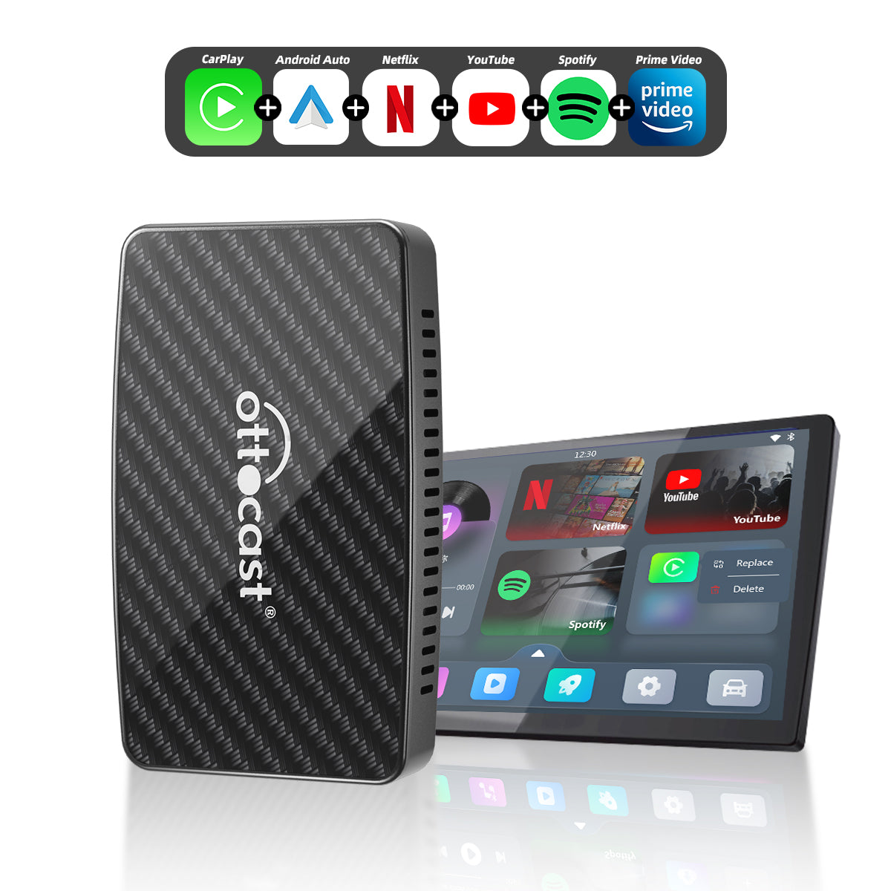
            </button><button type="button" class="product-gallery__thumbnail" aria-current="false" aria-label="Ir para o item 2">
            </button><button type="button" class="product-gallery__thumbnail" aria-current="false" aria-label="Ir para o item 3">
            </button><button type="button" class="product-gallery__thumbnail" aria-current="false" aria-label="Go to item 4">
            </button><button type="button" class="product-gallery__thumbnail" aria-current="false" aria-label="Go to item 5">
            </button><button type="button" class="product-gallery__thumbnail" aria-current="false" aria-label="Go to item 6">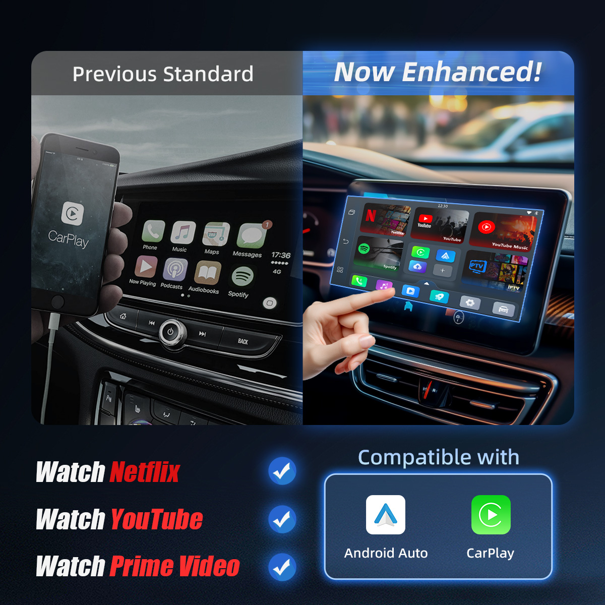
            </button><button type="button" class="product-gallery__thumbnail" aria-current="false" aria-label="Go to item 7">
            </button><button type="button" class="product-gallery__thumbnail" aria-current="false" aria-label="Go to item 8">
            </button><button type="button" class="product-gallery__thumbnail" aria-current="false" aria-label="Go to item 9">
            </button><button type="button" class="product-gallery__thumbnail" aria-current="false" aria-label="Ir para o item 10">
            </button><button type="button" class="product-gallery__thumbnail" aria-current="false" aria-label="Ir para o item 11">
            </button><button type="button" class="product-gallery__thumbnail" aria-current="false" aria-label="Ir para o item 12">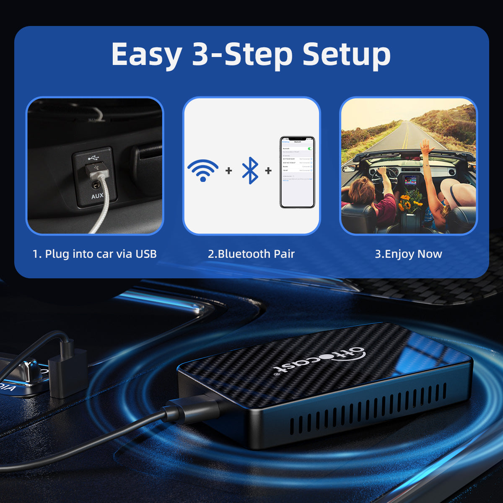
            </button><button type="button" class="product-gallery__thumbnail" aria-current="false" aria-label="Ir para o item 13">
            </button><button type="button" class="product-gallery__thumbnail" aria-current="false" aria-label="Ir para o item 14">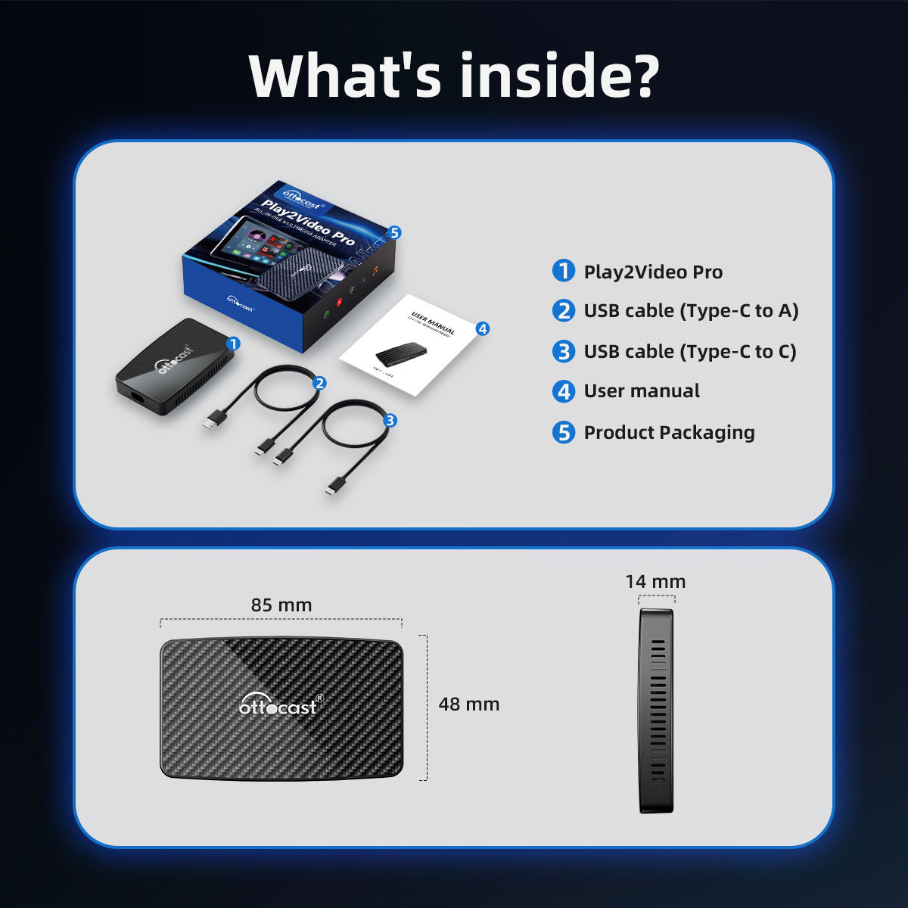
            </button><button type="button" class="product-gallery__thumbnail" aria-current="false" aria-label="Ir para o item 15">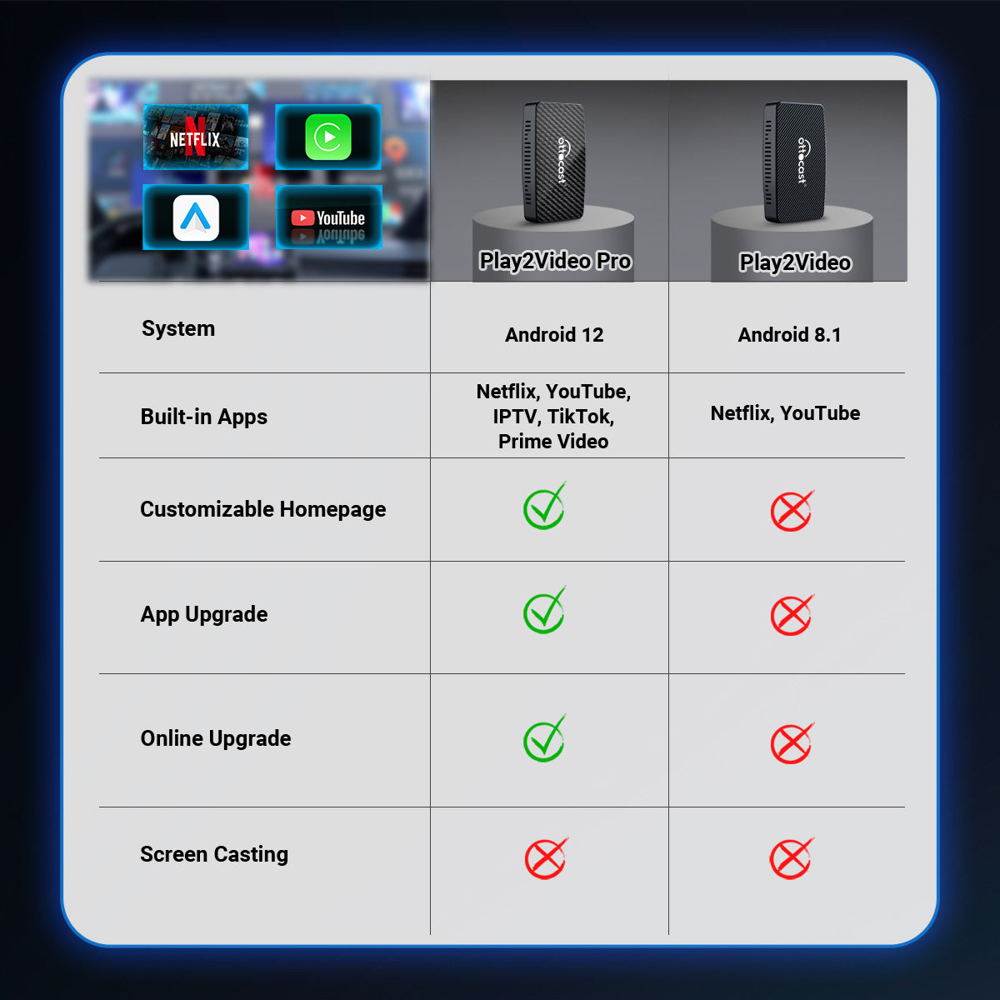
            </button><button type="button" class="product-gallery__thumbnail" aria-current="false" aria-label="Ir para o item 16">
            </button></page-dots>
      </scroll-shadow></product-gallery><safe-sticky class="product-info"><h1 class="product-info__title h3">✨Promoção de Dia dos Pais✨Play2Video Pro CarPlay sem fio/ Android Auto Adaptador tudo-em-um</h1>

          
<price-list role="region" aria-live="polite" class="price-list  "><sale-price form="product-form-7512232656974-template--17926005489742__main" class="h3">
      Sale price€78,95</sale-price>

    <compare-at-price form="product-form-7512232656974-template--17926005489742__main" hidden="" class="text-subdued line-through">
      Regular price</compare-at-price><unit-price form="product-form-7512232656974-template--17926005489742__main" hidden="" class="text-subdued">(/)
      </unit-price></price-list>
<sold-out-badge hidden="" form="product-form-7512232656974-template--17926005489742__main" class="badge badge--sold-out">Esgotado</sold-out-badge>
<a href="#shopify-product-avaliações" class="rating " title="13 avaliações">4.9
<svg role="presentation" fill="none" focusable="false" width="12" height="12" class="rating__star icon icon-rating-star" viewBox="0 0 15 15">
        <path d="M7.5 0L9.58587 5.2731L15 5.72949L10.875 9.44483L12.1353 15L7.5 12.0231L2.86475 15L4.125 9.44483L0 5.72949L5.41414 5.2731L7.5 0Z" fill="currentColor"></path>
      </svg>

  </a>

<payment-terms class="product-info__payment-terms" form="product-form-7512232656974-template--17926005489742__main"><form method="post" action="/cart/add" id="product-installment-form-template--17926005489742__main-7512232656974" accept-charset="UTF-8" class="shopify-product-form" enctype="multipart/form-data"><input type="hidden" name="form_type" value="product"><input type="hidden" name="utf8" value="✓"><input type="hidden" name="id" value="42045392552014"><input type="hidden" name="product-id" value="7512232656974"><input type="hidden" name="section-id" value="template--17926005489742__main"></form></payment-terms>

            
📶 Habilita CarPlay sem fio ou Android Auto

🍿 Assista a Netflix, YouTube, Spotify, Amazon Video e IPTV etc.

⚡ Configuração em segundos

          

<variant-picker class="variant-picker" handle="play2video-pro" form="product-form-7512232656974-template--17926005489742__main" update-url="">

      <fieldset class="variant-picker__option no-js:hidden">
        

          

            <legend class="text-subdued">🎉Preço final de Black Friday:</legend>
            <variant-option-value form="product-form-7512232656974-template--17926005489742__main" for="option1">Pacote único</variant-option-value>
          

            

              <input class="sr-only" type="radio" name="option1" form="product-form-7512232656974-template--17926005489742__main" id="option-value-template--17926005489742__main-product-form-7512232656974-template--17926005489742__main--option1-single-pack" value="Pacote único" checked="checked"><label class="block-swatch" for="option-value-template--17926005489742__main-product-form-7512232656974-template--17926005489742__main--option1-single-pack" data-option-value="">Pacote único
      </label><input class="sr-only" type="radio" name="option1" form="product-form-7512232656974-template--17926005489742__main" id="option-value-template--17926005489742__main-product-form-7512232656974-template--17926005489742__main--option1-2-pack-30-off-free-shipping" value="Pacote com 2 (30% DESCONTO + Frete grátis)"><label class="block-swatch" for="option-value-template--17926005489742__main-product-form-7512232656974-template--17926005489742__main--option1-2-pack-30-off-free-shipping" data-option-value="">Pacote com 2 (30% DESCONTO + Frete grátis)
      </label>
            

          
</fieldset><noscript>

  <select id="select-template--17926005489742__main-product-form-7512232656974-template--17926005489742__main-id" class="select select--native is-floating" name="id" form="product-form-7512232656974-template--17926005489742__main"
  
  
><option selected="selected"  value="42045392552014">Pacote único - €78,95</option><option   value="42045392584782">Pacote com 2 (30% DESCONTO + Frete grátis) - €138,95</option></select><svg role="presentation" focusable="false" width="10" height="7" class="select-chevron icon icon-chevron-bottom" viewBox="0 0 10 7">
        <path d="m1 1 4 4 4-4" fill="none" stroke="currentColor" stroke-width="2"></path>
      </svg><label for="select-template--17926005489742__main-product-form-7512232656974-template--17926005489742__main-id" class="floating-label">Variante</label>
</noscript>
  </variant-picker>

            

              <label for="product-form-7512232656974-template--17926005489742__main-quantity" class="block-label text-subdued">Quantidade:</label>

              <quantity-selector class="quantity-selector">
                <button type="button" class="quantity-selector__button" aria-label="Diminuir quantidade"><svg role="presentation" focusable="false" width="10" height="2" class="icon icon-minus" viewBox="0 0 10 2">
        <path d="M0 0H10V2H0V0Z" fill="currentColor"></path>
      </svg></button>
                <input id="product-form-7512232656974-template--17926005489742__main-quantity" type="text" is="quantity-input" inputmode="numeric" class="quantity-selector__input" name="quantity" form="product-form-7512232656974-template--17926005489742__main" size="2" value="1" autocomplete="off">
                <button type="button" class="quantity-selector__button" aria-label="Aumentar quantidade"><svg role="presentation" focusable="false" stroke-width="2" width="10" height="10" class="icon icon-plus" viewBox="0 0 12 12">
        <path d="M6 0V12" fill="none" stroke="currentColor"></path>
        <path d="M0 6L12 6" fill="none" stroke="currentColor"></path>
      </svg></button>
              </quantity-selector>
            

          

<form method="post" action="/cart/add" id="product-form-7512232656974-template--17926005489742__main" accept-charset="UTF-8" class="shopify-product-form" enctype="multipart/form-data" is="product-form"><input type="hidden" name="form_type" value="product"><input type="hidden" name="utf8" value="✓"><input type="hidden" disabled="" name="id" value="42045392552014">
<buy-buttons class="buy-buttons buy-buttons--multiple" template="ca400s-ziti" form="product-form-7512232656974-template--17926005489742__main">
<button type="submit" class="button button--xl button--secondary" is="custom-button">Adicionar ao carrinho</button>
 <shopify-accelerated-checkout recommended="{" supports_subs":true,"supports_def_opts":false,"name":"shop_pay","wallet_params":{"shopid":62023237710,"merchantname":"ottocastdrive","personalized":false}}"="" fallback="{" supports_subs":true,"supports_def_opts":true,"name":"buy_it_now","wallet_params":{}}"="" access-token="3372d182559a43c5814ca9357521371a" buyer-country="NL" buyer-locale="pt-BR" buyer-currency="EUR" variant-params="[{" id":42045392552014,"requiresshipping":true},{"id":42045392584782,"requiresshipping":true}]"="" shop-id="62023237710" enabled-flags="[" d6d12da0","32a68cd0","a1c7ccbe","ce346acf","c0874428"]"=""> 
  
  </shopify-accelerated-checkout>  
</buy-buttons>
  
<input type="hidden" name="product-id" value="7512232656974"><input type="hidden" name="section-id" value="template--17926005489742__main"></form>

            <!-- Custom Liquid 模块代码 -->

<!-- Trigger/Open The Modal -->
<button id="checkCompatibilidadeBtn">❗Verificar compatibilidade do veículo</button>
  
<!-- The Modal -->

  

    ×
    

      <!-- Snippet: vehicle-data -->
  <h2>Lista de modelos de veículos compatíveis
   
Se o seu modelo não estiver listado, verifique se ele suporta CarPlay com fio ou entre em contato conosco para obter ajuda

  </h2>

<h3 class="ui-accordion-header ui-corner-top ui-state-default ui-accordion-icons ui-accordion-header-collapsed ui-corner-all" role="tab" id="ui-id-3" aria-controls="ui-id-4" aria-selected="false" aria-expanded="false" tabindex="0">
  
  Abarth
  +
</h3>

  
2017 - 2024 Abarth 595

  
2017 - 2024 Abarth 695

  
2023 - 2024 Abarth 500e

<h3 class="ui-accordion-header ui-corner-top ui-state-default ui-accordion-icons ui-accordion-header-collapsed ui-corner-all" role="tab" id="ui-id-5" aria-controls="ui-id-6" aria-selected="false" aria-expanded="false" tabindex="0">
  
  Acura
  +
</h3>

  
2017 - 2023 NSX

  
2018 - 2024 MDX

  
2018 - 2024 TLX

  
2019 - 2022 ILX

  
2019 - 2024 RDX

  
2023 - 2024 Integra

@@ -3010,57 +3010,57 @@ Shopify.routes.root = "/";</script>
  
2023 - 2024 VF8

  
2023 - 2024 VF9

<h3 class="ui-accordion-header ui-corner-top ui-state-default ui-accordion-icons ui-accordion-header-collapsed ui-corner-all" role="tab" id="ui-id-167" aria-controls="ui-id-168" aria-selected="false" aria-expanded="false" tabindex="0">
  
  VW
  +
</h3>

  
2016 Spacefox

  
2016 - 2018 CC

  
2016 - 2018 Scirocco

  
2016 - 2024 Amarok

  
2016 - 2019 Beetle

  
2016 - 2019 Beetle Cabriolet

  
2016 - 2024 Golf R

  
2016 - 2024 Caddy

  
2016 - 2024 California

  
2016 - 2024 Caravelle

  
2016 - 2021 e‑Golf

  
2016 - 2021 Fox

  
2016 - 2024 Golf

  
2016 - 2024 Golf Cabriolet

  
2016 - 2024 Golf SportsVan

  
2016 - 2024 Golf Variante

  
2016 - 2024 Golf SportWagen

  
2016 - 2024 GTI

  
2016 - 2024 Jetta

  
2016 - 2024 Lamando

  
2016 - 2024 Multivan

  
2016 - 2022 Passat Variante

  
2016 - 2024 Polo

  
2016 - 2022 Sharan

  
2016 - 2024 Tiguan

  
2016 - 2024 Touran

  
2016 - 2024 Transporter

  
2016 - 2022 Passat

  
2017 - 2024 Atlas

  
2017 - 2024 Crafter

  
2017 - 2024 CrossFox

  
2017 - 2024 Gol

  
2017 - 2024 Saveiro

  
2017 - 2024 Voyage

  
2018 - 2024 Arteon

  
2018 - 2024 Bora

  
2018 - 2024 Magotan

  
2018 - 2024 Sagitar

  
2018 - 2024 T‑Roc

  
2021 - 2024 ID.3

  
2021 - 2024 ID.4

  
2022 - 2024 Taos

  
2022 - 2024 ID.5

  
2022 - 2024 ID.6

  
2022 - 2024 Talagon

  
2023 - 2024 ID.Buzz

  
2024 ID.7

@@ -3090,154 +3090,154 @@ Shopify.routes.root = "/";</script>
  +
</h3>

  
2017 - 2024 VV5

  
2017 - 2024 VV7

  
2018 - 2024 VV6

<h3 class="ui-accordion-header ui-corner-top ui-state-default ui-accordion-icons ui-accordion-header-collapsed ui-corner-all" role="tab" id="ui-id-173" aria-controls="ui-id-174" aria-selected="false" aria-expanded="false" tabindex="0">
  
  Zeekr
  +
</h3>

  
2023 - 2024 Zeekr X

  
2023 - 2024 Zeekr 001

    

  

          

  

Modelos compatíveis: apenas para veículos ou motos que possuem CarPlay com fio de fábrica<svg role="presentation" focusable="false" width="8" height="6" class="icon icon-chevron-bottom-small" viewBox="0 0 8 6">
        <path d="m1 1.5 3 3 3-3" fill="none" stroke="currentColor" stroke-width="1.5"></path>
      </svg>
    

  

  

<strong>❌Não compatível com BMW. Obtenha a versão para BMW aqui: </strong><a href="https://ottocastdrive.com/products/i3" target="_blank" title="https://ottocastdrive.com/products/i3"><strong>https://ottocastdrive.com/products/i3</strong></a>

Ideal para usuários Android e iPhone, com suporte para iOS 10/Android 11 ou superior e alguns celulares Samsung e Google.

<strong>❌Não compatível com central multimídia aftermarket da Sony</strong>

<strong>❌Para veículos Mitsubishi Motors, adicione uma observação no pedido na página do carrinho ou envie e-mail para nós.</strong>

  

 Nova geração Play2video Pro: solução 3 em 1<svg role="presentation" focusable="false" width="8" height="6" class="icon icon-chevron-bottom-small" viewBox="0 0 8 6">
        <path d="m1 1.5 3 3 3-3" fill="none" stroke="currentColor" stroke-width="1.5"></path>
      </svg>
    

  

  

<strong>Converta o CarPlay com fio original em CarPlay/Android Auto sem fio</strong>

✔Até 5 apps integrados: YouTube, Netflix, Spotify, Amazon Video e IPTV etc.

(*O download de aplicativos adicionais não é suportado*)

✔Sistema Android 12 mais fluido

✔Suporte a multimídia USB

✔Combine iOS CarPlay e Android Auto sem fio

✔USB conecte e use, sem necessidade de instalação

✔Conexão automática ao entrar no carro, sem fio

✔Todos os recursos originais do CarPlay são preservados

✔Atualização online

  

Frete rápido<svg role="presentation" focusable="false" width="8" height="6" class="icon icon-chevron-bottom-small" viewBox="0 0 8 6">
        <path d="m1 1.5 3 3 3-3" fill="none" stroke="currentColor" stroke-width="1.5"></path>
      </svg>
    

  

  

Seu pedido será processado em até 24 horas. Após entrar em trânsito, você poderá receber um e-mail quando as informações de rastreio forem atualizadas. Quando o pacote chegar, você deverá receber uma confirmação de entrega.

  

Garantia de reembolso de 30 dias<svg role="presentation" focusable="false" width="8" height="6" class="icon icon-chevron-bottom-small" viewBox="0 0 8 6">
        <path d="m1 1.5 3 3 3-3" fill="none" stroke="currentColor" stroke-width="1.5"></path>
      </svg>
    

  

  

Temos uma política de devolução de 30 dias, o que significa que você tem 30 dias após receber o item para solicitar reembolso.

          

            

              Share

              <ul class="h-stack" role="list">
                <li><a href="https://www.facebook.com/sharer.php?u=https://ottocastdrive.com/products/play2video-pro
" class="share-buttons__item" aria-label="Share on Facebook"><svg role="presentation" focusable="false" width="20" height="20" class="icon icon-facebook" viewBox="0 0 24 24">
        <path fill-rule="evenodd" clip-rule="evenodd" d="M10.183 21.85v-8.868H7.2V9.526h2.983V6.982a4.17 4.17 0 0 1 4.44-4.572 22.33 22.33 0 0 1 2.667.144v3.084h-1.83a1.44 1.44 0 0 0-1.713 1.68v2.208h3.423l-.447 3.456h-2.97v8.868h-3.57Z" fill="currentColor"></path>
      </svg></a></li>
                <li><a href="https://twitter.com/intent/tweet?text=%E2%9C%A8Father's%20Day%20Sale%E2%9C%A8Play2Video%20Pro%20Wireless%20CarPlay/%20Android%20Auto%20All-in-one%20Adapter&url=https://ottocastdrive.com/products/play2video-pro
" class="share-buttons__item" aria-label="Share on Twitter"><svg role="presentation" focusable="false" width="20" height="20" class="icon icon-twitter" viewBox="0 0 24 24">
        <path d="M16.94 4h2.715l-5.93 6.777L20.7 20h-5.462l-4.278-5.593L6.065 20H3.35l6.342-7.25L3 4h5.6l3.868 5.113L16.94 4Zm-.952 14.375h1.504L7.784 5.54H6.17l9.818 12.836Z" fill="currentColor"></path>
      </svg></a></li>
                <li><a href="https://pinterest.com/pin/create/button/?url=https://ottocastdrive.com/products/play2video-pro&media=https://ottocastdrive.com/cdn/shop/files/CA400V4.jpg?v=1752568491&width=800&description=%0A%0A%0A%09%0A%09%09%0A%09%09%09%0A%09%09%09%20%0A%09%09%0A%09%09%0A%09%09%09%0A%09%09%09%09%0A%09%09%09%09%0A%09%09%09%09%09New%20All-in-one%20Technology%20%0A%09%09%09%09%0A%09%09%09%09%0A%09%09%09%09%0A%09%09%09%09%0A%09%09%09%09%09%20Budget-friendly%20Play2video%20for%20in-car%20movie%20viewing%20is%20a%20hit%20among%20car%20enthusiasts%20and%20provides%20excell...
" class="share-buttons__item" aria-label="Compartilhar no Pinterest"><svg role="presentation" focusable="false" width="20" height="20" class="icon icon-pinterest" viewBox="0 0 24 24">
        <path fill-rule="evenodd" clip-rule="evenodd" d="M11.765 2.401c3.59-.054 5.837 1.4 6.895 3.95.349.842.722 2.39.442 3.675-.112.512-.144 1.048-.295 1.53-.308.983-.708 1.853-1.238 2.603-.72 1.02-1.81 1.706-3.182 2.052-1.212.305-2.328-.152-2.976-.643-.206-.156-.483-.36-.56-.643h-.029c-.046.515-.244 1.062-.383 1.531-.193.65-.23 1.321-.472 1.929a12.345 12.345 0 0 1-.942 1.868c-.184.302-.692 1.335-1.061 1.347-.04-.078-.057-.108-.06-.245-.118-.19-.035-.508-.087-.766-.082-.4-.145-1.123-.06-1.53v-.643c.096-.442.092-.894.207-1.317.25-.92.39-1.895.648-2.848.249-.915.477-1.916.678-2.847.045-.21-.21-.815-.265-1.041-.174-.713-.042-1.7.176-2.236.275-.674 1.08-1.703 2.122-1.439.838.212 1.371 1.118 1.09 2.266-.295 1.205-.677 2.284-.943 3.49-.068.311.05.641.118.827.248.672 1 1.324 2.004 1.072 1.52-.383 2.193-1.76 2.652-3.246.124-.402.109-.781.206-1.225.204-.935.118-2.331-.177-3.061-.472-1.17-1.353-1.92-2.563-2.328L12.707 4.3c-.56-.128-1.626.064-2.004.183-1.69.535-2.737 1.427-3.388 3.032-.222.546-.344 1.1-.383 1.868l-.03.276c.13.686.144 1.14.413 1.653.132.252.447.451.5.765.032.185-.104.464-.147.613-.065.224-.041.48-.147.673-.192.349-.714.087-.943-.061-1.192-.77-2.175-2.995-1.62-5.144.085-.332.09-.62.206-.919.723-1.844 1.802-2.978 3.359-3.95.583-.364 1.37-.544 2.092-.734l1.149-.154Z" fill="currentColor"></path>
      </svg></a></li>
                <li><a href="mailto:?&subject=✨Promoção de Dia dos Pais✨Play2Video Pro CarPlay sem fio/ Android Auto Adaptador tudo-em-um&body=https://ottocastdrive.com/products/play2video-pro
" class="share-buttons__item" aria-label="Share by email"><svg role="presentation" fill="none" focusable="false" stroke-width="1.5" width="18" height="14" class="icon icon-email" viewBox="0 0 18 14">
        <path clip-rule="evenodd" d="M1 2.5A1.5 1.5 0 0 1 2.5 1h13A1.5 1.5 0 0 1 17 2.5v9a1.5 1.5 0 0 1-1.5 1.5h-13A1.5 1.5 0 0 1 1 11.5v-9Z" stroke="currentColor" stroke-linecap="round" stroke-linejoin="round"></path>
        <path d="m16 2-5.61 4.506c-.82.659-1.96.659-2.78 0L2 2" stroke="currentColor" stroke-linecap="round" stroke-linejoin="round"></path>
      </svg></a></li>
              </ul>
            

          

          <button is="share-button" class="product-info__native-share"><svg role="presentation" fill="none" focusable="false" stroke-width="1.5" width="16" height="18" class="icon icon-share" viewBox="0 0 16 18">
        <path d="M5.50006 7L10.0166 4.29005M5.50006 10L10.0166 12.7099M10.0166 4.29005C10.1604 5.53412 11.2174 6.5 12.5 6.5C13.8807 6.5 15 5.38071 15 4C15 2.61929 13.8807 1.5 12.5 1.5C11.1193 1.5 10 2.61929 10 4C10 4.09811 10.0057 4.19489 10.0166 4.29005ZM10.0166 12.7099C10.0057 12.8051 10 12.9019 10 13C10 14.3807 11.1193 15.5 12.5 15.5C13.8807 15.5 15 14.3807 15 13C15 11.6193 13.8807 10.5 12.5 10.5C11.2174 10.5 10.1604 11.4659 10.0166 12.7099ZM6 8.5C6 9.88071 4.88071 11 3.5 11C2.11929 11 1 9.88071 1 8.5C1 7.11929 2.11929 6 3.5 6C4.88071 6 6 7.11929 6 8.5Z" stroke="currentColor" stroke-linejoin="round"></path>
      </svg>Share</button>
        
</safe-sticky>

<product-quick-add form="product-form-7512232656974-template--17926005489742__main" class="product-quick-add"><buy-buttons template="ca400s-ziti" form="product-form-7512232656974-template--17926005489742__main" force-secondary-button="" class="sm:hidden">
<button type="submit" class="button button--lg button--secondary w-full" form="product-form-7512232656974-template--17926005489742__main" is="custom-button">Adicionar ao carrinho</button></buy-buttons>
<variant-media widths="80,160" form="product-form-7512232656974-template--17926005489742__main"></variant-media>
<a href="/products/play2video-pro" class="bold truncate-text">✨Promoção de Dia dos Pais✨Play2Video Pro CarPlay sem fio/ Android Auto Adaptador tudo-em-um</a><price-list role="region" aria-live="polite" class="price-list  "><sale-price form="product-form-7512232656974-template--17926005489742__main" class="text-subdued">
      Sale price€78,95</sale-price>

    <compare-at-price form="product-form-7512232656974-template--17926005489742__main" hidden="" class="text-subdued line-through">
      Regular price</compare-at-price><unit-price form="product-form-7512232656974-template--17926005489742__main" hidden="" class="text-subdued text-sm">(/)
      </unit-price></price-list>

      <buy-buttons template="ca400s-ziti" form="product-form-7512232656974-template--17926005489742__main" force-secondary-button="">
<button type="submit" class="button button--secondary" form="product-form-7512232656974-template--17926005489742__main" is="custom-button">Adicionar ao carrinho</button></buy-buttons>
    

  </product-quick-add><template id="quick-buy-content">
<variant-media widths="80,160" form="quick-buy-form-7512232656974-template--17926005489742__main"></variant-media>

      <a href="/products/play2video-pro" class="bold justify-self-start">✨Promoção de Dia dos Pais✨Play2Video Pro CarPlay sem fio/ Android Auto Adaptador tudo-em-um</a><price-list role="region" aria-live="polite" class="price-list  "><sale-price form="quick-buy-form-7512232656974-template--17926005489742__main" class="text-subdued">
      Sale price€78,95</sale-price>

    <compare-at-price form="quick-buy-form-7512232656974-template--17926005489742__main" hidden="" class="text-subdued line-through">
      Regular price</compare-at-price><unit-price form="quick-buy-form-7512232656974-template--17926005489742__main" hidden="" class="text-subdued text-sm">(/)
      </unit-price></price-list>

  

  
<variant-picker class="variant-picker" handle="play2video-pro" form="quick-buy-form-7512232656974-template--17926005489742__main">

      <fieldset class="variant-picker__option no-js:hidden">
        

          

            <legend class="text-subdued">🎉Preço final de Black Friday:</legend>
            <variant-option-value form="quick-buy-form-7512232656974-template--17926005489742__main" for="option1">Pacote único</variant-option-value>
          

            

              <input class="sr-only" type="radio" name="option1" form="quick-buy-form-7512232656974-template--17926005489742__main" id="option-value-template--17926005489742__main-quick-buy-form-7512232656974-template--17926005489742__main--option1-single-pack" value="Pacote único" checked="checked"><label class="block-swatch" for="option-value-template--17926005489742__main-quick-buy-form-7512232656974-template--17926005489742__main--option1-single-pack" data-option-value="">Pacote único
      </label><input class="sr-only" type="radio" name="option1" form="quick-buy-form-7512232656974-template--17926005489742__main" id="option-value-template--17926005489742__main-quick-buy-form-7512232656974-template--17926005489742__main--option1-2-pack-30-off-free-shipping" value="Pacote com 2 (30% DESCONTO + Frete grátis)"><label class="block-swatch" for="option-value-template--17926005489742__main-quick-buy-form-7512232656974-template--17926005489742__main--option1-2-pack-30-off-free-shipping" data-option-value="">Pacote com 2 (30% DESCONTO + Frete grátis)
      </label>
            

          
</fieldset><noscript>

  <select id="select-template--17926005489742__main-quick-buy-form-7512232656974-template--17926005489742__main-id" class="select select--native is-floating" name="id" form="quick-buy-form-7512232656974-template--17926005489742__main"
  
  
><option selected="selected"  value="42045392552014">Pacote único - €78,95</option><option   value="42045392584782">Pacote com 2 (30% DESCONTO + Frete grátis) - €138,95</option></select><svg role="presentation" focusable="false" width="10" height="7" class="select-chevron icon icon-chevron-bottom" viewBox="0 0 10 7">
        <path d="m1 1 4 4 4-4" fill="none" stroke="currentColor" stroke-width="2"></path>
      </svg><label for="select-template--17926005489742__main-quick-buy-form-7512232656974-template--17926005489742__main-id" class="floating-label">Variante</label>
</noscript>
  </variant-picker><form method="post" action="/cart/add" id="quick-buy-form-7512232656974-template--17926005489742__main" accept-charset="UTF-8" class="shopify-product-form" enctype="multipart/form-data" is="product-form"><input type="hidden" name="form_type" value="product"><input type="hidden" name="utf8" value="✓"><input type="hidden" disabled="" name="id" value="42045392552014">
<buy-buttons class="buy-buttons buy-buttons--multiple" template="ca400s-ziti" form="quick-buy-form-7512232656974-template--17926005489742__main">
<button type="submit" class="button button--lg button--secondary" is="custom-button">Adicionar ao carrinho</button>
 <shopify-accelerated-checkout recommended="{" supports_subs":true,"supports_def_opts":false,"name":"shop_pay","wallet_params":{"shopid":62023237710,"merchantname":"ottocastdrive","personalized":false}}"="" fallback="{" supports_subs":true,"supports_def_opts":true,"name":"buy_it_now","wallet_params":{}}"="" access-token="3372d182559a43c5814ca9357521371a" buyer-country="NL" buyer-locale="pt-BR" buyer-currency="EUR" variant-params="[{" id":42045392552014,"requiresshipping":true},{"id":42045392584782,"requiresshipping":true}]"="" shop-id="62023237710" enabled-flags="[" d6d12da0","32a68cd0","a1c7ccbe","ce346acf","c0874428"]"=""> 
 
 
 
 
 
 </shopify-accelerated-checkout> <small id="shopify-buyer-consent" class="hidden" aria-hidden="true" data-consent-type="subscription"> Este item é uma compra recorrente ou adiada. Ao continuar, concordo com a política de cancelamento e autorizo a cobrança no meu método de pagamento pelos preços, frequências e datas listados nesta página até que meu pedido seja concluído ou até que eu cancele, se permitido. </small> 
</buy-buttons>
  
<input type="hidden" name="product-id" value="7512232656974"><input type="hidden" name="section-id" value="template--17926005489742__main"></form>

</template>

</section>

  

    

      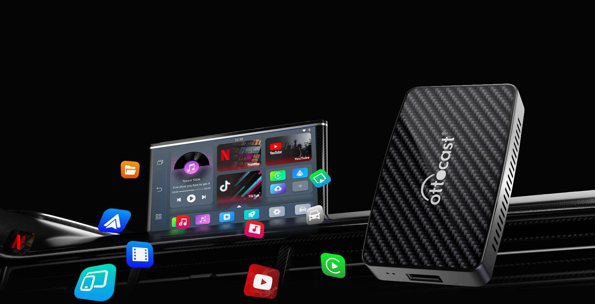
      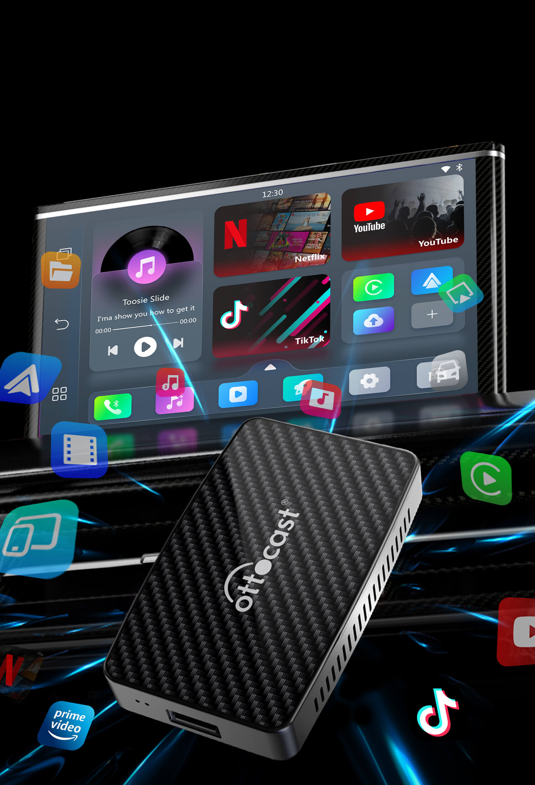
    

    <!-- 
Tecnologia tudo-em-um de nova geração

    
Play2Video Pro encanta os entusiastas automotivos com desempenho mais rápido e recursos ampliados, garantindo satisfação superior dos clientes.
 -->
    
Tecnologia tudo-em-um de nova geração

    
Play2Video Pro encanta os entusiastas automotivos com desempenho mais rápido e recursos ampliados, garantindo satisfação superior dos clientes.

  

  

    

      
      
    

    <!-- 
A Sensational Upgrade: Built-in Five Apps

    
(Note:Downloading additional apps is not supported.)

    
Play2Video Pro inclui cinco aplicativos integrados — Netflix, YouTube, IPTV, Spotify e YouTube Music.
 -->
    
A Sensational Upgrade: Built-in Five Apps

    
(Note:Downloading additional apps is not supported.)

    
Play2Video Pro inclui cinco aplicativos integrados — Netflix, YouTube, IPTV, Spotify e YouTube Music.

  

  

    

      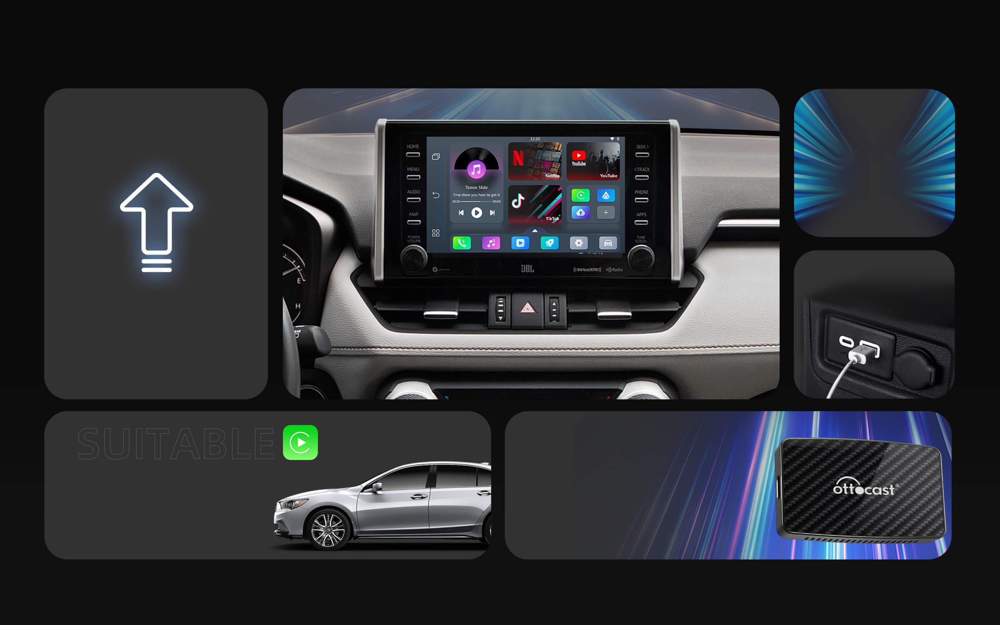
      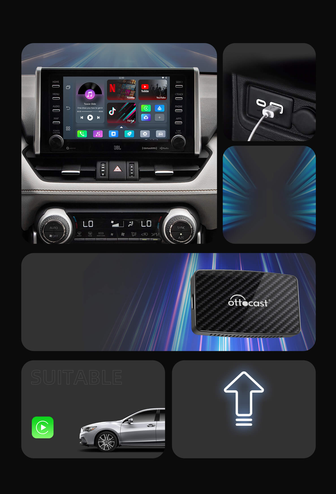
    

    <!-- 
14s

    
90%

    
Play2Video Pro

    
Play2Video Pro

    
Atualizações online fáceis

    
Adequado para veículos com CarPlay de fábrica

    
auto re-connect

    
USB Plug & Play

    
(Muttiple update methods)

    
Increase by

    
compared to others
 -->
    
14s

    
90%

    
Play2Video Pro

    
Play2Video Pro

    
Atualizações online fáceis

    
Adequado para veículos com CarPlay de fábrica

    
auto re-connect

    
USB Plug & Play

    
(Muttiple update methods)

    
Increase by

    
compared to others

  

  

    

      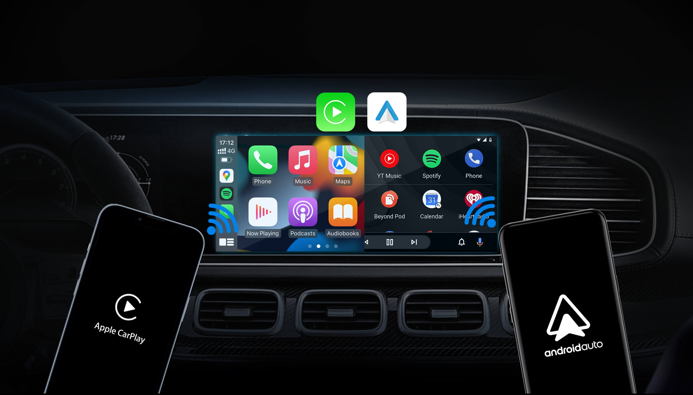
      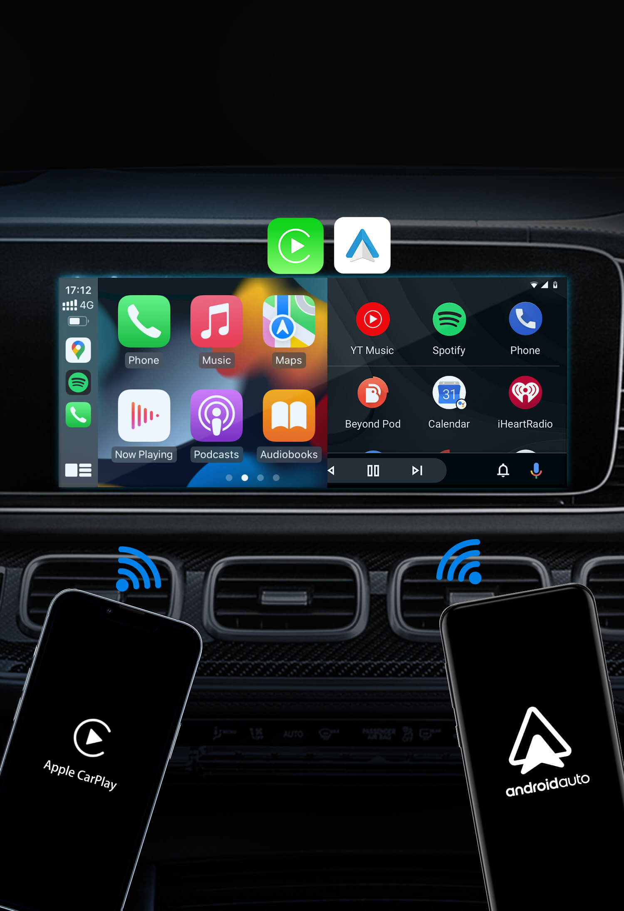
    

    <!-- 
CarPlay sem fio e Android Auto

    
Inteligente o suficiente para reconhecer o modelo do seu celular. Compatível com celulares Android e Apple, sendo uma ótima escolha para toda a família.
 -->
    
CarPlay sem fio e Android Auto

    
Inteligente o suficiente para reconhecer o modelo do seu celular. Compatível com celulares Android e Apple, sendo uma ótima escolha para toda a família.

  

  

    

      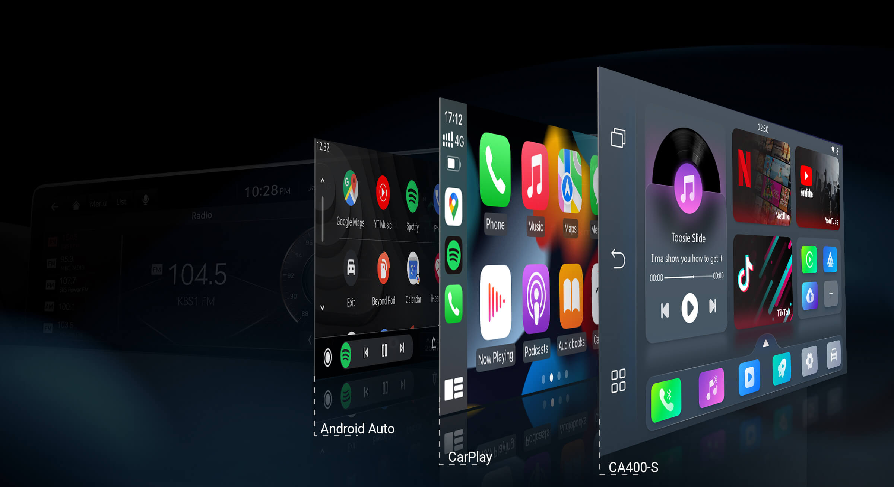
      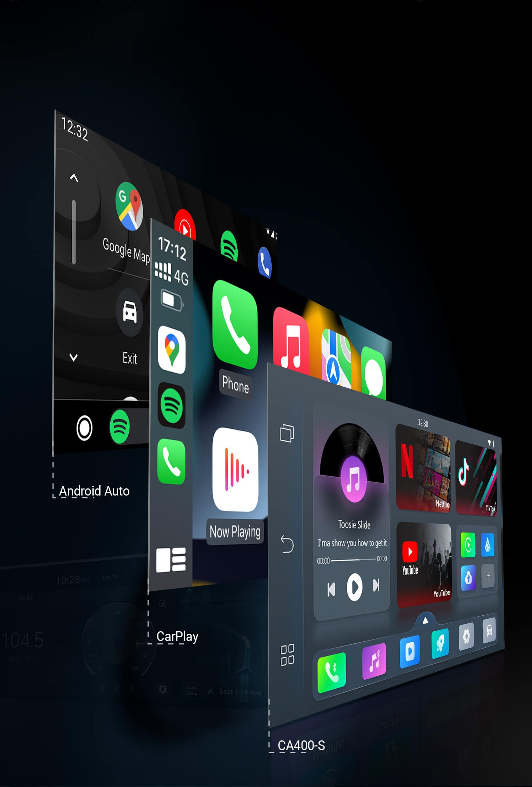
    

    <!-- 
Alternância entre três sistemas a qualquer momento

    
Alterne facilmente entre o sistema Android 12.0, CarPlay sem fio e Android Auto sem fio a qualquer momento
 -->
    
Alternância entre três sistemas a qualquer momento

    
Alterne facilmente entre o sistema Android 12.0, CarPlay sem fio e Android Auto sem fio a qualquer momento

  

  

    

      
      
    

    <!-- 
Enhanced Reprodução multimídia via USB
 -->
    
Enhanced Reprodução multimídia via USB

  

  

    

      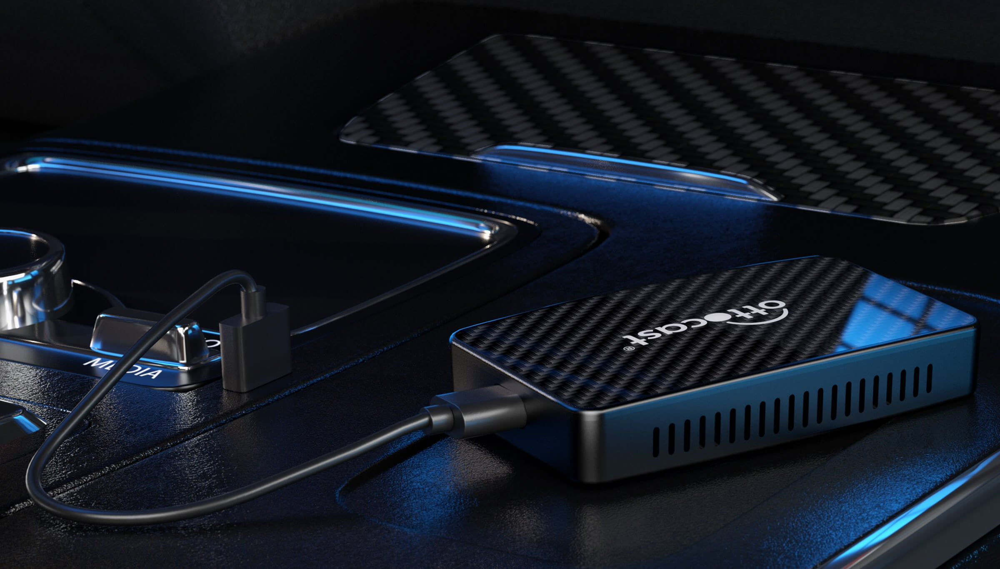
      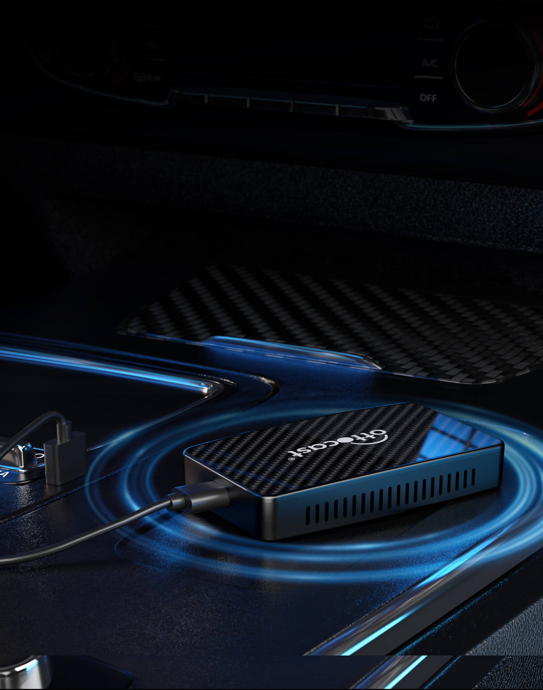
    

    <!-- 
Conexão automática e super desempenho

    
O Wi-Fi de banda dupla e o processador de dois núcleos ajudam a eliminar atrasos e oferecem conexão fluida em tempo real para uso sem travamentos
 -->
    
Conexão automática e super desempenho

    
O Wi-Fi de banda dupla e o processador de dois núcleos ajudam a eliminar atrasos e oferecem conexão fluida em tempo real para uso sem travamentos

  

  

    

      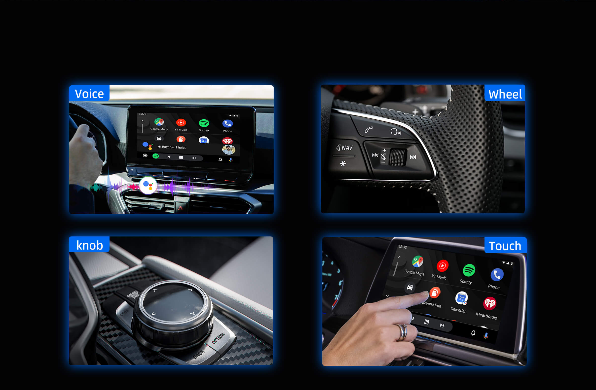
      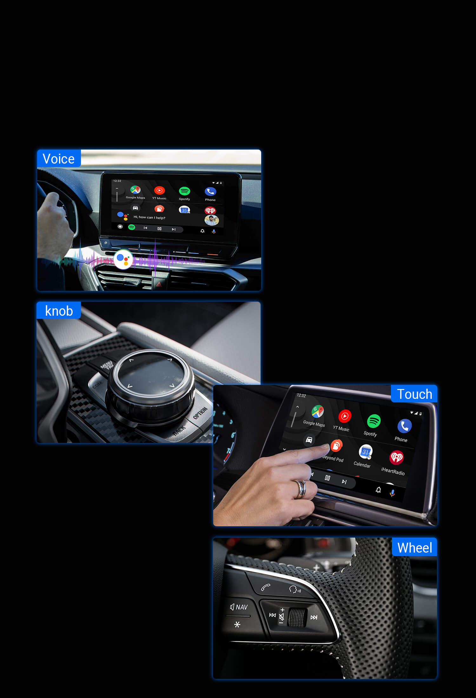
    

    <!-- 
Totalmente integrado ao painel original do seu carro

    
Perfeitamente compatível com os controles originais do seu carro, incluindo comando de voz, controle no volante e controle por tela sensível ao toque (*funções de botão giratório e controle remoto aguardam ativação em futura atualização OTA).
 -->
    
Totalmente integrado ao painel original do seu carro

    
Perfeitamente compatível com os controles originais do seu carro, incluindo comando de voz, controle no volante e controle por tela sensível ao toque (*funções de botão giratório e controle remoto aguardam ativação em futura atualização OTA).

  

  

    

      
      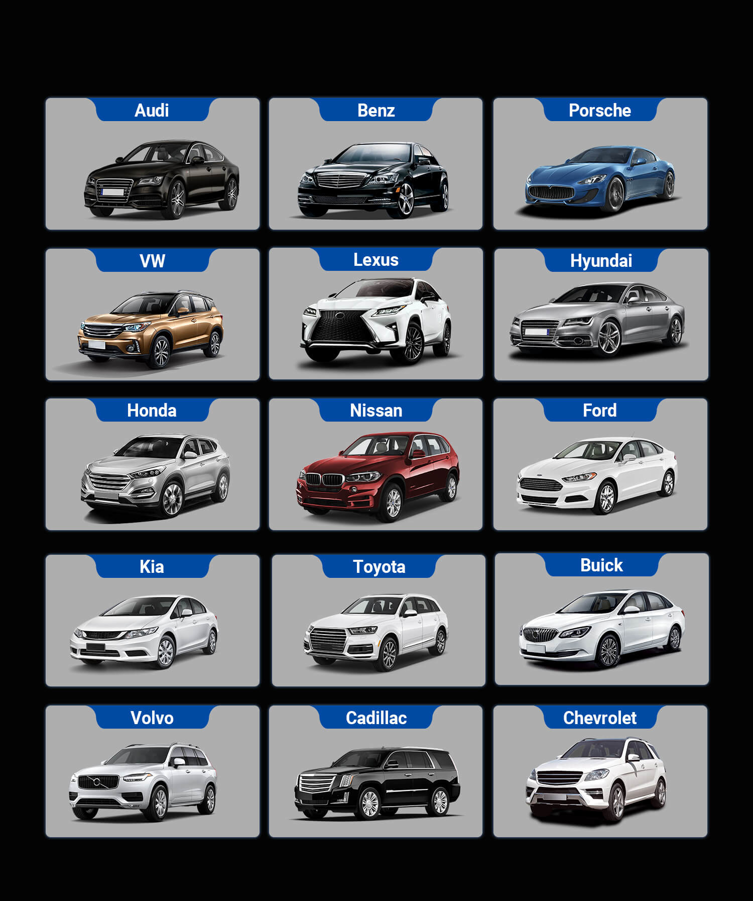
    

    <!-- 
Adequado para uso em 98% dos modelos de carro
 -->
    
Adequado para uso em 98% dos modelos de carro

  

  

  

<section id="shopify-section-template--17926005489742__related-products" class="shopify-section shopify-section--product-recommendations">

  

  <section-header class="section-header ">
<h2 class="h2" reveal-on-scroll="true"><split-lines>You may also like</split-lines></h2>
</section-header>
<scroll-carousel selector="product-card" id="scroll-area-template--17926005489742__related-products" class="scroll-area bleed is-scrollable">
          <reveal-items selector=".product-list > *">
            <product-list class="product-list"><product-card handle="wireless-controller" class="product-card product-card--blends product-card--show-secondary-media bg-custom text-custom" style="--background: 255 255 255; --text-color: 26 26 26;">

      
<form method="post" action="/cart/add" id="product_form_7437931413582" accept-charset="UTF-8" class="shopify-product-form" enctype="multipart/form-data" is="product-form"><input type="hidden" name="form_type" value="product"><input type="hidden" name="utf8" value="✓"><input type="hidden" name="id" value="41745262411854">

              

                <button type="submit" is="custom-button" class="product-card__mobile-quick-buy-button" aria-label="+ Adição rápida"><svg role="presentation" fill="none" stroke-width="2" focusable="false" width="16" height="15" class="icon icon-quick-buy-cart" viewBox="0 0 16 15">
            <path d="M4.5 3.545H15l-2.546 5.728H5.136L3.546 1H1" stroke="currentColor" stroke-linecap="round" stroke-linejoin="round"></path>
            <circle cx="5.955" cy="12.682" r=".5" fill="#252627" stroke="currentColor" stroke-linecap="round" stroke-linejoin="round"></circle>
            <circle cx="11.5" cy="12.682" r=".5" fill="#252627" stroke="currentColor" stroke-linecap="round" stroke-linejoin="round"></circle>
          </svg></button>
              

              

<button type="submit" class="button" is="custom-button">+ Adição rápida</button>
<input type="hidden" name="product-id" value="7437931413582"><input type="hidden" name="section-id" value="template--17926005489742__related-products"></form>

<a href="/products/wireless-controller" class="bold" data-instant="">Controle sem fio</a><price-list class="price-list  "><sale-price class="text-subdued">
        Sale price€13,95</sale-price></price-list>

</product-card><product-card handle="ottocas-1-year-extended-warranty" class="product-card product-card--blends  bg-custom text-custom" style="--background: 255 255 255; --text-color: 26 26 26;">

      
<form method="post" action="/cart/add" id="product_form_7437930758222" accept-charset="UTF-8" class="shopify-product-form" enctype="multipart/form-data" is="product-form"><input type="hidden" name="form_type" value="product"><input type="hidden" name="utf8" value="✓"><input type="hidden" name="id" value="41745261264974">

              

                <button type="submit" is="custom-button" class="product-card__mobile-quick-buy-button" aria-label="+ Adição rápida"><svg role="presentation" fill="none" stroke-width="2" focusable="false" width="16" height="15" class="icon icon-quick-buy-cart" viewBox="0 0 16 15">
            <path d="M4.5 3.545H15l-2.546 5.728H5.136L3.546 1H1" stroke="currentColor" stroke-linecap="round" stroke-linejoin="round"></path>
            <circle cx="5.955" cy="12.682" r=".5" fill="#252627" stroke="currentColor" stroke-linecap="round" stroke-linejoin="round"></circle>
            <circle cx="11.5" cy="12.682" r=".5" fill="#252627" stroke="currentColor" stroke-linecap="round" stroke-linejoin="round"></circle>
          </svg></button>
              

              

<button type="submit" class="button" is="custom-button">+ Adição rápida</button>
<input type="hidden" name="product-id" value="7437930758222"><input type="hidden" name="section-id" value="template--17926005489742__related-products"></form>

<a href="/products/ottocas-1-year-extended-warranty" class="bold" data-instant="">OTTOCARE + Garantia estendida de 1 ano</a><price-list class="price-list  "><sale-price class="text-subdued">
        Sale price€7,95</sale-price></price-list>

</product-card><product-card handle="fast-car-charger" class="product-card product-card--blends product-card--show-secondary-media bg-custom text-custom" style="--background: 255 255 255; --text-color: 26 26 26;">

      
<form method="post" action="/cart/add" id="product_form_7437929709646" accept-charset="UTF-8" class="shopify-product-form" enctype="multipart/form-data" is="product-form"><input type="hidden" name="form_type" value="product"><input type="hidden" name="utf8" value="✓"><input type="hidden" name="id" value="41745258479694">

              

                <button type="submit" is="custom-button" class="product-card__mobile-quick-buy-button" aria-label="+ Adição rápida"><svg role="presentation" fill="none" stroke-width="2" focusable="false" width="16" height="15" class="icon icon-quick-buy-cart" viewBox="0 0 16 15">
            <path d="M4.5 3.545H15l-2.546 5.728H5.136L3.546 1H1" stroke="currentColor" stroke-linecap="round" stroke-linejoin="round"></path>
            <circle cx="5.955" cy="12.682" r=".5" fill="#252627" stroke="currentColor" stroke-linecap="round" stroke-linejoin="round"></circle>
            <circle cx="11.5" cy="12.682" r=".5" fill="#252627" stroke="currentColor" stroke-linecap="round" stroke-linejoin="round"></circle>
          </svg></button>
              

              

<button type="submit" class="button" is="custom-button">+ Adição rápida</button>
<input type="hidden" name="product-id" value="7437929709646"><input type="hidden" name="section-id" value="template--17926005489742__related-products"></form>

<a href="/products/fast-car-charger" class="bold" data-instant="">Fast  Car Charger</a><price-list class="price-list  "><sale-price class="text-subdued">
        Sale price€14,95</sale-price></price-list>

</product-card><product-card handle="mini-wireless-carplay-adapter" class="product-card product-card--blends product-card--show-secondary-media bg-custom text-custom" style="--background: 255 255 255; --text-color: 26 26 26;">

      <a href="/products/mini-wireless-carplay-adapter" data-instant="">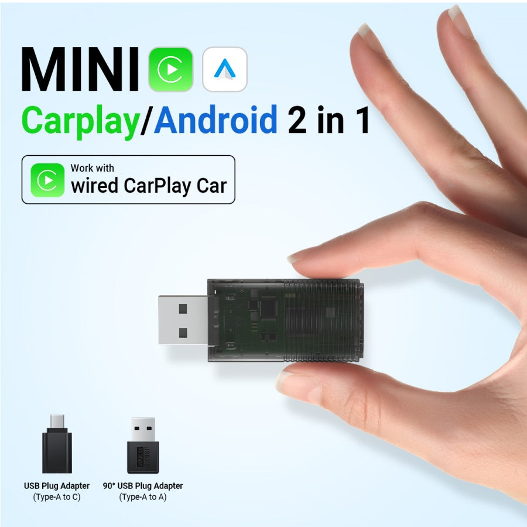</a>

              <button type="button" aria-controls="quick-buy-template--17926005489742__related-products-7437930463310" aria-expanded="false" aria-label="+ Adição rápida" is="custom-button" class="product-card__mobile-quick-buy-button"><svg role="presentation" fill="none" stroke-width="2" focusable="false" width="16" height="15" class="icon icon-quick-buy-cart" viewBox="0 0 16 15">
            <path d="M4.5 3.545H15l-2.546 5.728H5.136L3.546 1H1" stroke="currentColor" stroke-linecap="round" stroke-linejoin="round"></path>
            <circle cx="5.955" cy="12.682" r=".5" fill="#252627" stroke="currentColor" stroke-linecap="round" stroke-linejoin="round"></circle>
            <circle cx="11.5" cy="12.682" r=".5" fill="#252627" stroke="currentColor" stroke-linecap="round" stroke-linejoin="round"></circle>
          </svg></button>
            

            

<button type="button" class="button" aria-controls="quick-buy-template--17926005489742__related-products-7437930463310" aria-expanded="false" is="custom-button">+ Adição rápida</button>

            <quick-buy-drawer id="quick-buy-template--17926005489742__related-products-7437930463310" header-bordered="" open-from="bottom" handle="mini-wireless-carplay-adapter?variant=41745260576846" role="region" aria-live="polite" class="quick-buy-drawer drawer"></quick-buy-drawer>

<a href="/products/mini-wireless-carplay-adapter" class="bold" data-instant="">Mini Adaptador CarPlay sem fio</a><price-list class="price-list  "><sale-price class="text-subdued">
        Sale priceFrom €25,95
</sale-price></price-list>

</product-card><product-card handle="i3" class="product-card product-card--blends product-card--show-secondary-media bg-custom text-custom" style="--background: 255 255 255; --text-color: 26 26 26;">

      

              <button type="button" aria-controls="quick-buy-template--17926005489742__related-products-7437929775182" aria-expanded="false" aria-label="+ Adição rápida" is="custom-button" class="product-card__mobile-quick-buy-button"><svg role="presentation" fill="none" stroke-width="2" focusable="false" width="16" height="15" class="icon icon-quick-buy-cart" viewBox="0 0 16 15">
            <path d="M4.5 3.545H15l-2.546 5.728H5.136L3.546 1H1" stroke="currentColor" stroke-linecap="round" stroke-linejoin="round"></path>
            <circle cx="5.955" cy="12.682" r=".5" fill="#252627" stroke="currentColor" stroke-linecap="round" stroke-linejoin="round"></circle>
            <circle cx="11.5" cy="12.682" r=".5" fill="#252627" stroke="currentColor" stroke-linecap="round" stroke-linejoin="round"></circle>
          </svg></button>
            

            

<button type="button" class="button" aria-controls="quick-buy-template--17926005489742__related-products-7437929775182" aria-expanded="false" is="custom-button">+ Adição rápida</button>

            <quick-buy-drawer id="quick-buy-template--17926005489742__related-products-7437929775182" header-bordered="" open-from="bottom" handle="i3?variant=41745258577998" role="region" aria-live="polite" class="quick-buy-drawer drawer"></quick-buy-drawer>

<a href="/products/i3" class="bold" data-instant="">🌿🌿O melhor presente de primavera para donos de BMW - GANHE 30% DE DESCONTO ⚡OttoAibox i3 BMW CarPlay AI Box</a><price-list class="price-list  "><sale-price class="text-subdued">
        Sale price€217,95</sale-price></price-list>

</product-card></product-list>
          </reveal-items>
        </scroll-carousel>

  

</section><section id="shopify-section-template--17926005489742__faq_33eRjh" class="shopify-section shopify-section--faq">

  

        

<h2 class="h2">Questions? We've got answers.</h2>

      

        

  

Will this work in my car?<svg role="presentation" focusable="false" width="8" height="6" class="icon icon-chevron-bottom-small" viewBox="0 0 8 6">
        <path d="m1 1.5 3 3 3-3" fill="none" stroke="currentColor" stroke-width="1.5"></path>
      </svg>
    

  

  

O OTTOCAST PLAY2VIDEO funciona em 98% dos veículos equipados com CarPlay com fio, incluindo centrais multimídia aftermarket da Alpine, Kenwood e Pioneer.

  

How quickly can I set it up?<svg role="presentation" focusable="false" width="8" height="6" class="icon icon-chevron-bottom-small" viewBox="0 0 8 6">
        <path d="m1 1.5 3 3 3-3" fill="none" stroke="currentColor" stroke-width="1.5"></path>
      </svg>
    

  

  

A maioria das pessoas configura e coloca para funcionar em poucos minutos. As instruções acompanham a caixa e também estão no nosso centro de ajuda.

  

Will this work on aftermarket CarPlay devices?<svg role="presentation" focusable="false" width="8" height="6" class="icon icon-chevron-bottom-small" viewBox="0 0 8 6">
        <path d="m1 1.5 3 3 3-3" fill="none" stroke="currentColor" stroke-width="1.5"></path>
      </svg>
    

  

  

Sim, qualquer dispositivo CarPlay aftermarket com porta USB também funciona com o Ottocast Play2video

  

Ele reproduz vídeos enquanto o veículo está em movimento?<svg role="presentation" focusable="false" width="8" height="6" class="icon icon-chevron-bottom-small" viewBox="0 0 8 6">
        <path d="m1 1.5 3 3 3-3" fill="none" stroke="currentColor" stroke-width="1.5"></path>
      </svg>
    

  

  

Sim, funciona em movimento, mas por segurança e por questões legais você deve usar o Ottocast Play2Video Pro somente com o veículo estacionado em local seguro. (Verifique a legislação local antes de usar).

      

Nosso suporte ao cliente está disponível de segunda a sexta: 8h às 17h.Average answer time: 24h

  

</section><section id="shopify-section-template--17926005489742__1725353710c122a811" class="shopify-section shopify-section--apps">
</section>
<!-- BEGIN sections: footer-group -->
<section id="shopify-section-sections--17926003818574__text-with-icons" class="shopify-section shopify-section-group-footer-group shopify-section--text-with-icons">

  

    

        <scroll-carousel class="text-with-icons__list scroll-area full-bleed md:unbleed" id="carousel-sections--17926003818574__text-with-icons" role="region">

<svg role="presentation" fill="none" focusable="false" stroke-width="2" width="24" height="24" class="sm:hidden icon icon-picto-timer" viewBox="0 0 24 24">
        <path d="M12 22.488A8.874 8.874 0 1 0 12 4.74a8.874 8.874 0 0 0 0 17.748v0Z" fill="currentColor" fill-opacity=".12" stroke="currentColor" stroke-linecap="round" stroke-linejoin="round"></path>
        <path d="M1.512 4.74a14.021 14.021 0 0 1 4.034-3.228M22.488 4.74a14.021 14.021 0 0 0-4.033-3.228M12 8.774v4.837h4.034" stroke="currentColor" stroke-linecap="round" stroke-linejoin="round"></path>
      </svg><svg role="presentation" fill="none" focusable="false" stroke-width="2" width="24" height="24" class="hidden sm:block icon icon-picto-timer" viewBox="0 0 24 24">
        <path d="M12 22.488A8.874 8.874 0 1 0 12 4.74a8.874 8.874 0 0 0 0 17.748v0Z" fill="currentColor" fill-opacity=".12" stroke="currentColor" stroke-linecap="round" stroke-linejoin="round"></path>
        <path d="M1.512 4.74a14.021 14.021 0 0 1 4.034-3.228M22.488 4.74a14.021 14.021 0 0 0-4.033-3.228M12 8.774v4.837h4.034" stroke="currentColor" stroke-linecap="round" stroke-linejoin="round"></path>
      </svg>

                

Garantia de 1 ano

<strong>8h às 17h.</strong>Se o seu dispositivo não funcionar como esperado, entre em contato com nossa equipe de suporte, que ajudará com qualquer problema. Todos os dispositivos Ottocast são cobertos por nossa garantia de 1 ano.

              

            

<svg role="presentation" fill="none" focusable="false" stroke-width="2" width="24" height="24" class="sm:hidden icon icon-picto-award-gift" viewBox="0 0 24 24">
        <path d="M21 4.911H9.696A1.714 1.714 0 0 0 7.98 6.626v6.392a1.714 1.714 0 0 0 1.715 1.715H21a1.714 1.714 0 0 0 1.714-1.715V6.624A1.714 1.714 0 0 0 21 4.91v.001Z" fill="currentColor" fill-opacity=".12"></path>
        <path d="M22.714 12.375V6.624A1.714 1.714 0 0 0 21 4.91H9.696A1.714 1.714 0 0 0 7.98 6.624v2.109" stroke="currentColor" stroke-linecap="round" stroke-linejoin="round"></path>
        <path d="m12.891 1.286 2.457 3.625 2.454-3.625M11.117 17.633l-.206-2.172a3.429 3.429 0 0 0-2.575-3l-1.6-.404a13.713 13.713 0 0 0-4.197-.39l-1.223.076v7.371l5.433 2.532a11.058 11.058 0 0 0 8.834.221l5.54-2.25a1.823 1.823 0 0 0-1.106-3.462l-7.378 1.752-5.852-1.056" stroke="currentColor" stroke-linecap="round" stroke-linejoin="round"></path>
        <path d="M15.348 4.911v8.695" stroke="currentColor" stroke-linecap="round"></path>
      </svg><svg role="presentation" fill="none" focusable="false" stroke-width="2" width="24" height="24" class="hidden sm:block icon icon-picto-award-gift" viewBox="0 0 24 24">
        <path d="M21 4.911H9.696A1.714 1.714 0 0 0 7.98 6.626v6.392a1.714 1.714 0 0 0 1.715 1.715H21a1.714 1.714 0 0 0 1.714-1.715V6.624A1.714 1.714 0 0 0 21 4.91v.001Z" fill="currentColor" fill-opacity=".12"></path>
        <path d="M22.714 12.375V6.624A1.714 1.714 0 0 0 21 4.91H9.696A1.714 1.714 0 0 0 7.98 6.624v2.109" stroke="currentColor" stroke-linecap="round" stroke-linejoin="round"></path>
        <path d="m12.891 1.286 2.457 3.625 2.454-3.625M11.117 17.633l-.206-2.172a3.429 3.429 0 0 0-2.575-3l-1.6-.404a13.713 13.713 0 0 0-4.197-.39l-1.223.076v7.371l5.433 2.532a11.058 11.058 0 0 0 8.834.221l5.54-2.25a1.823 1.823 0 0 0-1.106-3.462l-7.378 1.752-5.852-1.056" stroke="currentColor" stroke-linecap="round" stroke-linejoin="round"></path>
        <path d="M15.348 4.911v8.695" stroke="currentColor" stroke-linecap="round"></path>
      </svg>

                

DEVOLUÇÃO EM 30 DIAS

Você pode devolver qualquer item em até 30 dias a partir da data de entrega. Trocas e crédito na loja são aceitos por até 60 dias da data de entrega.<em>Venda final</em> itens não elegíveis para devolução.

              

            

<svg role="presentation" fill="none" focusable="false" stroke-width="2" width="24" height="24" class="sm:hidden icon icon-picto-like" viewBox="0 0 24 24">
        <path d="M7.05 19.41H6V9.6h1.05l4.17-7.234a2.16 2.16 0 0 1 4.008 1.376l-.4 2.875h3.412c1.491 0 4.476 1.492 4.476 4.474 0 2.983-3 9.81-6.173 9.81-4.178 0-7.75-.995-9.49-1.492l-.002.002Z" stroke="currentColor" stroke-linecap="round" stroke-linejoin="round"></path>
        <path d="M1.286 9.214a2.357 2.357 0 1 1 4.714 0v9.857a2.357 2.357 0 1 1-4.714 0V9.214Z" fill="currentColor" fill-opacity=".12" stroke="currentColor" stroke-linejoin="round"></path>
      </svg><svg role="presentation" fill="none" focusable="false" stroke-width="2" width="24" height="24" class="hidden sm:block icon icon-picto-like" viewBox="0 0 24 24">
        <path d="M7.05 19.41H6V9.6h1.05l4.17-7.234a2.16 2.16 0 0 1 4.008 1.376l-.4 2.875h3.412c1.491 0 4.476 1.492 4.476 4.474 0 2.983-3 9.81-6.173 9.81-4.178 0-7.75-.995-9.49-1.492l-.002.002Z" stroke="currentColor" stroke-linecap="round" stroke-linejoin="round"></path>
        <path d="M1.286 9.214a2.357 2.357 0 1 1 4.714 0v9.857a2.357 2.357 0 1 1-4.714 0V9.214Z" fill="currentColor" fill-opacity=".12" stroke="currentColor" stroke-linejoin="round"></path>
      </svg>

                

Desenvolvido com usuários reais

Com mais de 300.000 clientes, estamos construindo ativamente o melhor sistema de entretenimento automotivo. Valorizamos o feedback da nossa comunidade.

              

            
</scroll-carousel><page-dots aria-controls="carousel-sections--17926003818574__text-with-icons" class="page-dots peer-not-scrollable:hidden"><button type="button" class="tap-area" aria-current="true">
                Ir para o item 1
              </button><button type="button" class="tap-area" aria-current="false">
                Ir para o item 2
              </button><button type="button" class="tap-area" aria-current="false">
                Ir para o item 3
              </button></page-dots>

    

  
</section><footer id="shopify-section-sections--17926003818574__footer" class="shopify-section shopify-section-group-footer-group shopify-section--footer">

  

    

Cadastre-se para receber novidades e ofertas personalizadas
<form method="post" action="/contact#footer-newsletter" id="footer-newsletter" accept-charset="UTF-8" class="footer__newsletter-form form"><input type="hidden" name="form_type" value="customer"><input type="hidden" name="utf8" value="✓"><input type="hidden" name="contact[tags]" value="newsletter">
<input id="input-sections--17926003818574__footer--contactemail" class="input is-floating" type="email" dir="ltr" name="contact[email]" placeholder=" " autocomplete="email" enterkeyhint="send" required=""><label for="input-sections--17926003818574__footer--contactemail" class="floating-label">E-mail</label>

        <button type="submit" class="circle-chevron hover:colors">
          Inscrever-se<svg role="presentation" focusable="false" width="5" height="8" class="icon icon-chevron-right-small reverse-icon" viewBox="0 0 5 8">
        <path d="m.75 7 3-3-3-3" fill="none" stroke="currentColor" stroke-width="1.5"></path>
      </svg></button>
      

</form>

                

Produtos
<ul class="v-stack gap-3" role="list"><li>
                          <a href="/collections/ottoadapter" class="inline-block link-faded break-all">Ottoadapter</a>
                        </li><li>
                          <a href="/collections/carplay-ai-box" class="inline-block link-faded break-all">Ottoaibox</a>
                        </li><li>
                          <a href="/collections/carplay-screen" class="inline-block link-faded break-all">Ottoscreen</a>
                        </li><li>
                          <a href="/products/car-tv-mate-hdml-multimedia-wireless-carplay-adapter" class="inline-block link-faded break-all">Adaptador de TV para Carro</a>
                        </li></ul>
                  

Termos e Políticas
<ul class="v-stack gap-3" role="list"><li>
                          <a href="/policies/privacy-policy" class="inline-block link-faded break-all">Política de Privacidade</a>
                        </li><li>
                          <a href="/policies/refund-policy" class="inline-block link-faded break-all">Política de Reembolso</a>
                        </li><li>
                          <a href="/policies/shipping-policy" class="inline-block link-faded break-all">Política de Frete</a>
                        </li><li>
                          <a href="/policies/terms-of-service" class="inline-block link-faded break-all">Termos de Serviço</a>
                        </li><li>
                          <a href="/pages/intellectual-property-rights" class="inline-block link-faded break-all">DIREITOS DE PROPRIEDADE INTELECTUAL</a>
                        </li></ul>
                  

Suporte
<ul class="v-stack gap-3" role="list"><li>
                          <a href="/pages/about-us" class="inline-block link-faded break-all">Sobre Nós</a>
                        </li><li>
                          <a href="/pages/contact" class="inline-block link-faded break-all">Fale Conosco</a>
                        </li><li>
                          <a href="/pages/car-compatible-with-carplay-names-are-sorted-alphabetically-a-z" class="inline-block link-faded break-all">Compatibilidade</a>
                        </li></ul>
                  

<link rel="stylesheet" href="css/country-flags.css" media="print" onload="this.media='all'; this.onload = null">

      <button type="button" class="text-with-icon gap-2.5 group" aria-controls="popover-localization-form-country--sections--17926003818574__footer" aria-expanded="false">
        
EUR €
        
<svg role="presentation" focusable="false" width="10" height="7" class="icon icon-chevron-bottom" viewBox="0 0 10 7">
        <path d="m1 1 4 4 4-4" fill="none" stroke="currentColor" stroke-width="2"></path>
      </svg></button>

      <x-popover id="popover-localization-form-country--sections--17926003818574__footer" initial-focus="[aria-selected='true']" anchor-horizontal="start" anchor-vertical="start" class="popover">
        
Country
<form method="post" action="/localization" id="localization-form-country--sections--17926003818574__footer" accept-charset="UTF-8" class="shopify-localization-form" enctype="multipart/form-data"><input type="hidden" name="form_type" value="localization"><input type="hidden" name="utf8" value="✓"><input type="hidden" name="_method" value="put"><input type="hidden" name="return_to" value="/products/play2video-pro"><x-listbox class="popover-listbox popover-listbox--sm" role="listbox"><button type="submit" class="popover-listbox__option" name="country_code" role="option" value="AF">
                
                Afghanistan (AFN ؋)
              </button><button type="submit" class="popover-listbox__option" name="country_code" role="option" value="AX">
                
                Åland Islands (EUR €)
              </button><button type="submit" class="popover-listbox__option" name="country_code" role="option" value="AL">
                
                Albania (ALL L)
              </button><button type="submit" class="popover-listbox__option" name="country_code" role="option" value="DZ">
                
                Algeria (DZD د.ج)
              </button><button type="submit" class="popover-listbox__option" name="country_code" role="option" value="AD">
                
                Andorra (EUR €)
              </button><button type="submit" class="popover-listbox__option" name="country_code" role="option" value="AO">
